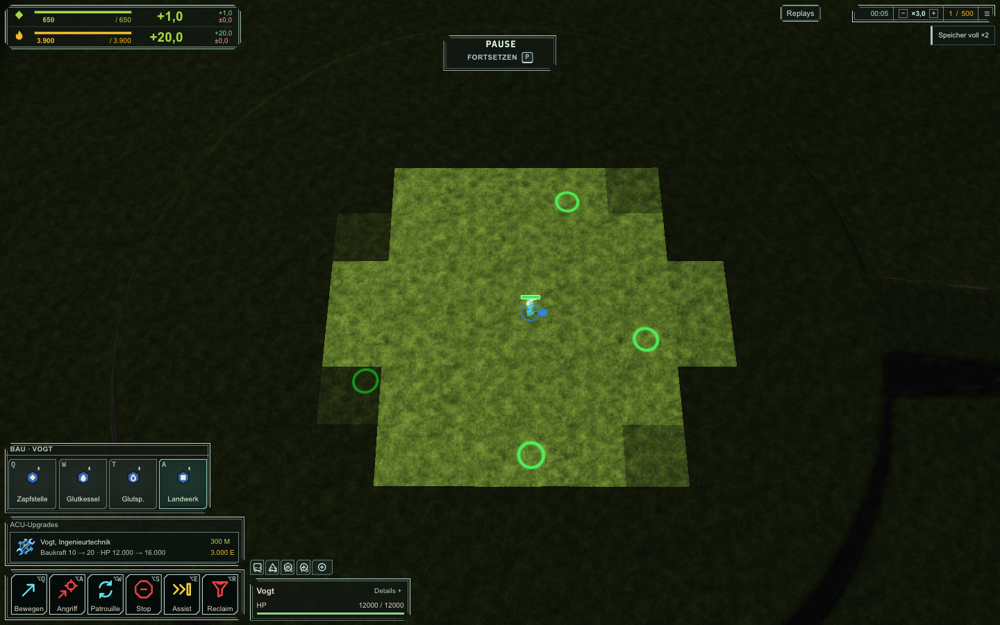

# Flow & Fire

**Masse gibt Form. Energie hält sie am Leben.**

Flow & Fire ist ein Echtzeitstrategiespiel für den Browser, inspiriert von *Supreme Commander: Forged Alliance*. Baue eine Basis, halte Masse und Energie im Gleichgewicht und führe deine Armee gegen die KI. Strategic Zoom verbindet die Übersicht über die Karte mit dem Geschehen einzelner Einheiten.

Das Projekt ist spielbar und wird weiterentwickelt. Die Simulation läuft deterministisch mit 10 Hz in einem Web Worker; WebGL2 zeichnet die Spielwelt, Preact das HUD. Die Performance-Abnahme ist noch nicht vollständig abgeschlossen.

[GitHub](https://github.com/LoggeL/flow-and-fire) · [HomeBox-Deployment](docs/deployment.md) · [Integrationsstand](docs/status/integration-goal.md) · [Projektplan](docs/PLAN.md)

**[Im Browser spielen](https://faf.logge.top/?menu=1)**. Läuft als Docker-Container auf der HomeBox.



## Spielen

Starte im Hauptmenü ein **Gefecht**. Wähle Karte, Startpositionen, Teams und KI-Schwierigkeit und klicke auf **Gefecht starten**. Beginne mit deinem Commander (ACU), baue Wirtschaft und Fabriken aus und stelle Einheiten zusammen. Kosten, Baufortschritt und Ressourcenengpässe erscheinen direkt im HUD.

Aktuell enthalten:

- Gefechte gegen die KI mit den Stufen Leicht, Normal und Schwer, konfigurierbaren Regeln und Karten.
- Masse- und Energiewirtschaft, Gebäudeplatzierung, Baureihen, Fabrikwarteschlangen und Wiederholproduktion; bezahlter Ausbau von Extraktoren und Landwerken bis T3.
- Commander, Pioniere, Späher, Panzer und Artillerie; bezahlte Engineering- und Panzerungsupgrades für den ACU.
- Vorerkundetes Gelände, Nebel des Krieges, Radar, Geschütztürme, Strategic Zoom, Mehrfachauswahl, Kontrollgruppen und kontextabhängige Rechtsklickbefehle.
- Kompaktes HUD mit Einheitenicons, Ressourcenfluss, Meldungen und deutschen sowie englischen Menüs.
- Ergebnisstatistik, Spielsound und Replay-Bibliothek mit Import, Export, Suche, Umbenennen, Zeitnavigation und Wiedergabetempo. Lokale Aufnahmen hängen von den Speicherfunktionen des Browsers ab.

## Schnellstart mit Docker

Benötigt Docker mit dem Compose-Plugin. Im Repository-Verzeichnis:

```sh
docker compose up -d --build
```

Öffne [localhost:8080](http://localhost:8080). Der Container baut das Spiel und liefert es als statische Website aus; gespielt und simuliert wird auf dem Rechner des jeweiligen Browsernutzers.

Ein anderer Host-Port:

```sh
FLOW_FIRE_PORT=8090 docker compose up -d --build
```

Für HomeBox, Updates und HTTPS siehe [Deployment](docs/deployment.md).

Docker bewahrt ausgelieferte Builds im persistenten Volume `flow-and-fire-releases`, damit Replays weiterhin ihren ursprünglichen Build laden können. Normales `docker compose down` erhält dieses Archiv.

## Lokal entwickeln

Benötigt **Node.js >=24**, **pnpm 11.10.0** und einen Browser mit WebGL2. Alle Befehle laufen aus dem Repository-Root.

```sh
npm install --global pnpm@11.10.0
git clone https://github.com/LoggeL/flow-and-fire.git
cd flow-and-fire
pnpm install --frozen-lockfile
pnpm assets
pnpm dev
```

Vite zeigt die lokale Adresse an, normalerweise [localhost:5173](http://localhost:5173). Der Dev-Server setzt die Header für Cross-Origin Isolation. Mit `Strg+C` beenden.

Nur das Spiel bauen und statisch starten:

```sh
pnpm --filter @faf/game build
pnpm --filter @faf/game run serve --host 0.0.0.0 --port 4173 --coi
```

## Steuerung

| Aktion | Eingabe |
| --- | --- |
| Einheit auswählen / Auswahlrahmen | Linksklick / linke Maustaste ziehen |
| Auswahl ergänzen | Shift + Auswahl |
| Alle eigenen Einheiten auswählen | Strg/⌘ + A |
| Kontextbefehl | Rechtsklick: bewegen, angreifen, reparieren, Bau unterstützen oder bewachen; ausgewählte Fabriken setzen ihren sichtbaren Sammelpunkt am angeklickten Ort |
| Befehl einreihen | Shift + Rechtsklick |
| Bauen | Bauoption im HUD wählen, dann gültigen Standort anklicken; Shift + Ziehen legt eine Baureihe an, Shift hält den Baumodus aktiv |
| Masseextraktor ausbauen | Einen fertigen Extraktor auswählen, im HUD T2 oder T3 wählen; Fortschritt, Pause und Abbruch stehen dort |
| Bau- oder Befehlsmodus abbrechen | Esc oder Rechtsklick |
| Auswahl stoppen | S kurz drücken |
| Kontrollgruppe speichern / aufrufen | Strg oder Alt + Ziffer / Ziffer; doppelt drücken zentriert die Kamera |
| Kamera bewegen | WASD/Pfeile halten, Bildschirmrand oder mittlere Maustaste ziehen |
| Zoomen / Kamera drehen | Mausrad / Strg/⌘ + mittlere Maustaste ziehen |
| Zum Commander / Kamera zurücksetzen | H / Pos1 |
| Pause / einzelner Tick | P oder Pause / N |
| Meldung anspringen / ältere Meldung | Leertaste / Shift + Leertaste |
| Vollbild | Alt + Enter |

Kontextbefehle richten sich nach Ziel und Fähigkeiten der eigenen Auswahl. Im Replay können keine Spielbefehle erteilt werden. Weitere Befehle und ihre Tasten stehen im HUD.

## Stand und offene Grenzen

UI, Bauabläufe, Upgrades, Kontextbefehle und stumme Audio-Prüfungen haben Nachweise in Chromium, Firefox und WebKit. Die ursprünglichen Performance-Gates bleiben teilweise offen: Eingabe (ACK-p95 <=100 ms, Startbewegung <=150 ms), kalte Navigation (p95 <=5 ms), KI (absoluter Whole-Sim-p95-Unterschied <=2%) und GPU (20 Schilde <=1 ms, zwei 2048²-Schattenkaskaden <=2,5 ms).

Diese Ziele beziehen sich auf die jeweils definierte Prüflast. Fehlende GPU-Timer gelten als nicht qualifiziert; Funktionstests ersetzen keine Zeitmessung. Details und Belege stehen im [Integrationsstatus](docs/status/integration-goal.md).

## Entwicklung und Prüfungen

```sh
pnpm typecheck
pnpm lint
pnpm test
```

Für Browserprüfungen zusätzlich:

```sh
pnpm exec playwright install chromium firefox webkit
pnpm test:e2e
```

Auf macOS steht für große Jobs zusätzlich `./tools/heavy` als Speicher- und Parallelitätsgate bereit, beispielsweise `./tools/heavy pnpm test`. Es benötigt zsh und macOS-Werkzeuge. Vergleichbare Zeitmessungen benötigen ein freies Messfenster. Die Standard-E2E-Prüfung ersetzt die getrennten strikten Performance-Gates nicht; automatisierte Audio-Browserprüfungen verbinden keinen Lautsprecherausgang.

Der Workspace enthält außerdem [KI-Werkzeuge](tools/ai-arena/), [Audio-Werkzeuge](tools/sfx/README.md), einen Kartenmarker-Editor, einen Modell-Viewer und ein FX-Lab. Aufbau und Regeln stehen in [DECISIONS](docs/DECISIONS.md), die Gestaltung unter [docs/design](docs/design/).

Hinweise zu den eingebundenen Bibliotheken und Schriften stehen in [THIRD_PARTY_NOTICES.txt](apps/game/public/THIRD_PARTY_NOTICES.txt). Für eigenen Projektcode ist derzeit keine Open-Source-Lizenz festgelegt.
