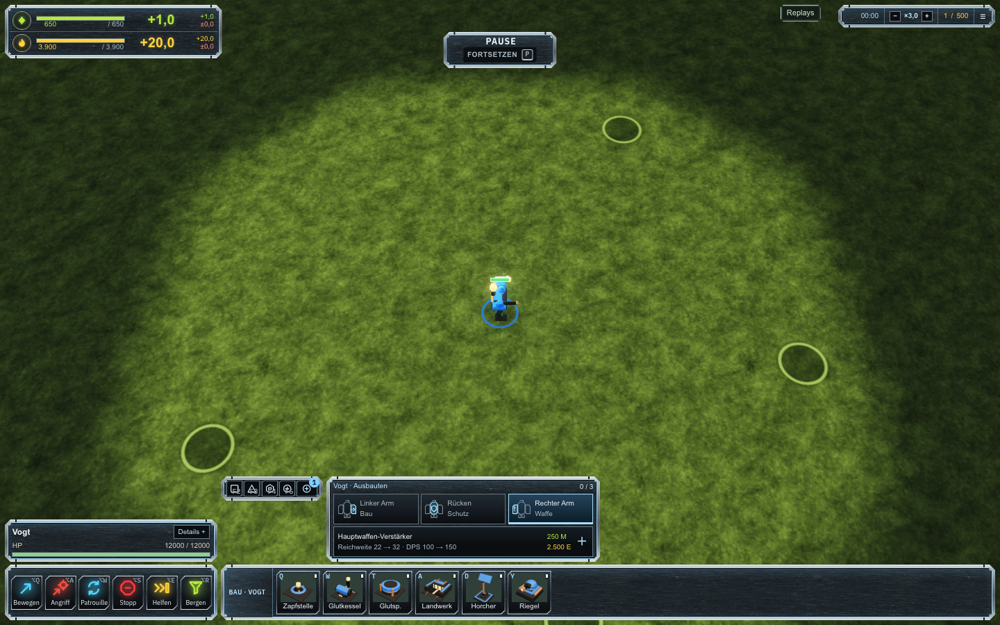
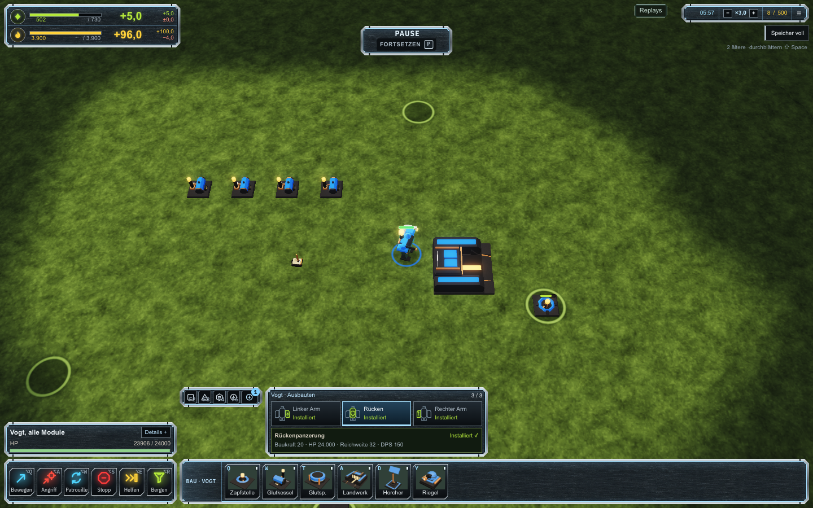
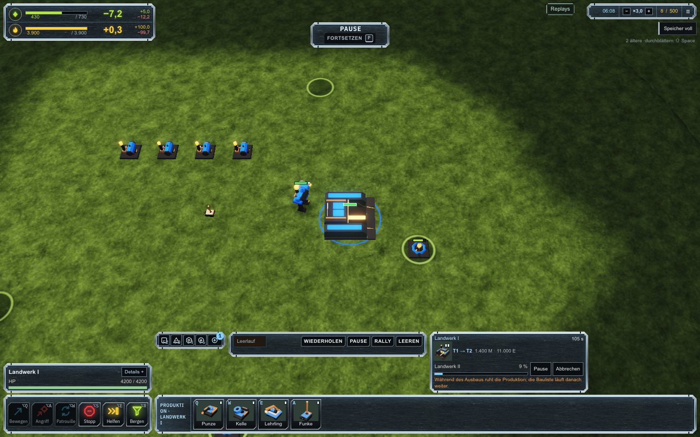
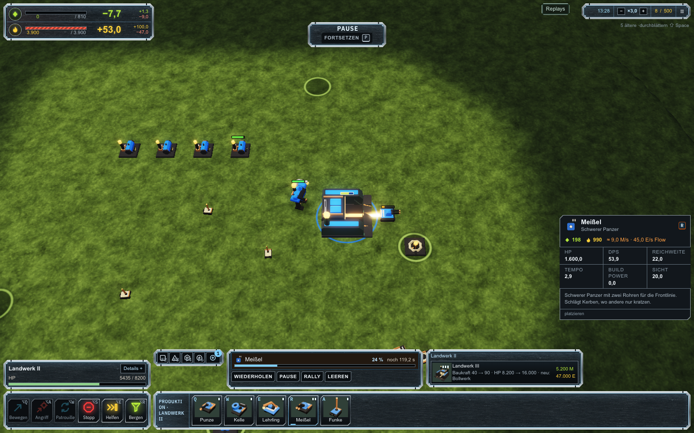
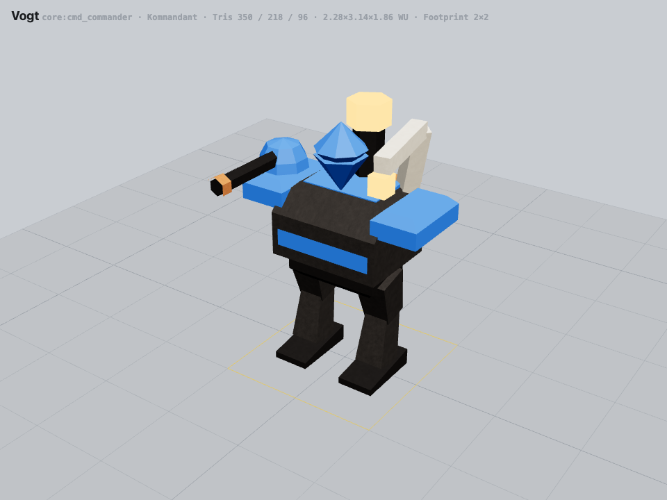
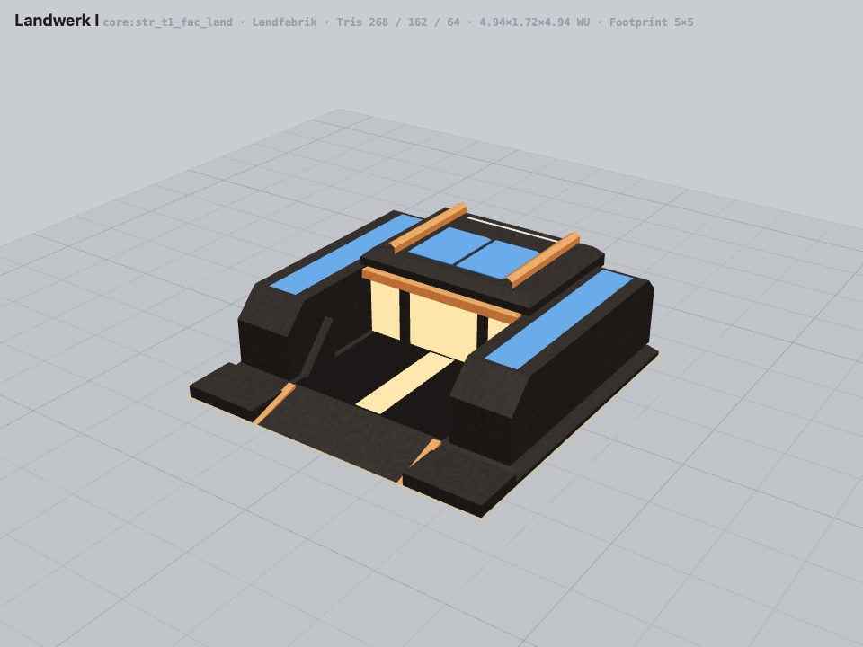

# Commander-Ausbau und Fabrikzustände

Die ACU-Auswahl verwendet drei getrennte Plätze nach der Forged-Alliance-Referenz: linker Arm, Rücken und rechter Arm. Die [UEF-Blueprints](https://github.com/FAForever/fa/blob/develop/units/UEL0001/UEL0001_unit.bp) legen Engineering auf LCH, den Hauptwaffen-Verstärker auf RCH und Schutzmodule auf Back. Unsere Varkan-Module bleiben eigene Spielinhalte und eigene Balancewerte. Die Rückenpanzerung erhöht HP; sie ist kein persönlicher FA-Schild. Das Baumodul erhöht die Baukraft und HP, ohne zusätzliche T2-Bauoptionen zu behaupten.

| Platz | Modul | Preis | Wirkung ausgehend vom Grundmodell |
| --- | --- | --- | --- |
| Linker Arm | Baumodul | 300 M, 3.000 E | Baukraft 10 auf 20; +4.000 HP |
| Rechter Arm | Hauptwaffen-Verstärker | 250 M, 2.500 E | Reichweite 22 auf 32; Schaden und DPS 100 auf 150 |
| Rücken | Rückenpanzerung | 400 M, 5.000 E | +8.000 HP |

Die Module lassen sich in jeder Reihenfolge einbauen. Ein bereits installiertes Modul bleibt bei weiteren Ausbauten erhalten. Kosten und Arbeitsmenge hängen nur vom neu hinzugefügten Modul ab. Der Einbau bezahlt Ressourcen schrittweise; Pause hält den Fortschritt an, Abbruch gibt keine Teilwirkung und keine Erstattung. Acht Blueprint-Kombinationen bilden den angenommenen Zustand ab. Slotwechsel in der UI ändert den laufenden Einbau nicht. Im Replay und bei fremden Einheiten bleiben Änderungen gesperrt.

Ein Landwerk zeigt den Nachfolgetier, sein tatsächliches Modell, den Preis, Fortschritt und die verfügbaren Steuerungen. Während seines Ausbaus pausiert die Produktion. Nach Abschluss bleibt derselbe Handle erhalten, das Modell wechselt und die T2-Produktion wird angeboten. Die bestehende Produktionsliste wird beim Abbruch erhalten.

Die Screenshots stammen aus einem regulären Gefecht auf Hollow Ridge mit leichter KI. Zwei Masseextraktoren, vier Generatoren und eine Fabrik wurden mit echten Baubefehlen errichtet; die Module und der Fabrikausbau wurden mit regulärem Einkommen bezahlt. Pausierte Host-Schritte beschleunigen ausschließlich die Prüfzeit. Es wurden keine Einheiten gespawnt und keine Ressourcen oder Spielzustände injiziert.

## Screenshots

## Modellüberarbeitung

Varkan erhält überarbeitete Panzerplatten, Arm- und Beingelenke, Rohrfassungen, Fabrikdächer und weitere lesbare Details. Weltabmessungen, Footprints, Partnamen, Animationspivots und Elternbeziehungen bleiben gültig. Alle 220 Modelle bestehen die Modellprüfung; überarbeitete Modelle halten die bestehenden Dreiecksbudgets von 350/220/110 ein.

Eine neue [ImageGen-Metalltextur samt vollständigem Prompt und Regenerationsweg](../../../content/textures/varkan/README.md) wird tatsächlich im Spiel und Modell-Viewer verwendet. Ein gemeinsames R8-Muster moduliert die Varkan-Materialien; Teamfarbe und Leuchtflächen behalten ihre vorhandene Lesbarkeit. Die optionalen Gewichte reisen durch rohe und Meshopt-GLBs bis zum Renderer, ohne einen zusätzlichen Drawcall oder einen größeren 40-Byte-Vertex zu benötigen. Alte Modelle bleiben kompatibel.

Der Modell-Viewer dient der Material- und Geometrieprüfung. Die Spielbilder oben stammen vom tatsächlichen Game-Renderer. Die Bauicons wurden anschließend aus den neuen Modellen regeneriert.

## Prüfung

- Native ACU-Bedienung in Chromium, Firefox und WebKit: Plätze, Pause, Fortsetzen, Abbruch, Rechnungsgrenzen, abgeschlossener Ausbau und untainted Replay-Export.
- Native Gefechtsscreens: 56 Aufnahmen an 1440×900, 1280×720, 1024×768 und 800×600; sichtbare Panels bleiben innerhalb des Fensters. Bei mindestens 1024 Pixeln bleibt der Dock höchstens 220 Pixel hoch.
- Alle sechs Modulreihenfolgen und native Kampfwirkung; bezahlte Replay-Aufnahme, Vorwärts- und Rückwärtsprüfung ohne Divergenzen. Neun aktualisierte Golden-Logs und neun Portable-Replays stimmen mit ihren Hashes überein.
- Backend-Verträge: 388 Fälle; die veraltete Roster-Erwartung wurde korrigiert und die betroffene Compiler-Suite erneut bestanden. Material-/Modell-Integration: 524 Fälle; die alte Erwartung von drei Commander-Varianten wurde auf acht erweitert und die betroffene Client-Suite erneut bestanden.
- Typprüfung, Lint, Abhängigkeitsgrenzen, Assetprüfung und Spielbuild bestanden. Alle Browserprüfungen haben vor der Navigation den stummen Audio-Ausgang installiert; Lautsprecher- und blockierte Verbindungen sind null.

Die Sim-Identität ist `faf-sim/ms6.4-commander-enhancements`, Sim-Hash `0x02629d13`. Ältere Replay-Builds bleiben im Docker-Archiv erhalten. Die Videos wurden mit [Quellen, Zeitmarken, sichtbaren Funktionen und Beobachtungsgrenzen](../gameplay-reference-2026-10-02.md) ausgewertet. Fremdes Videomaterial ist ausschließlich lokal unter `test-results` abgelegt und wird nicht als Spielasset ausgeliefert.
