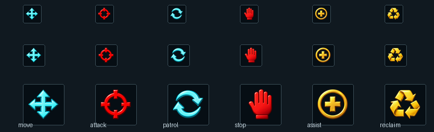
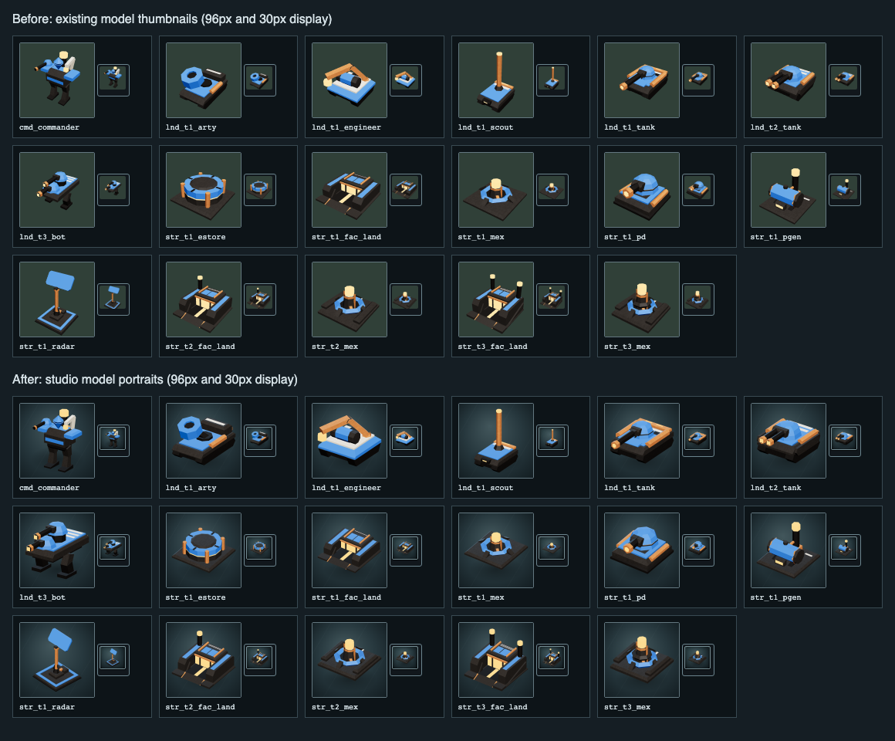
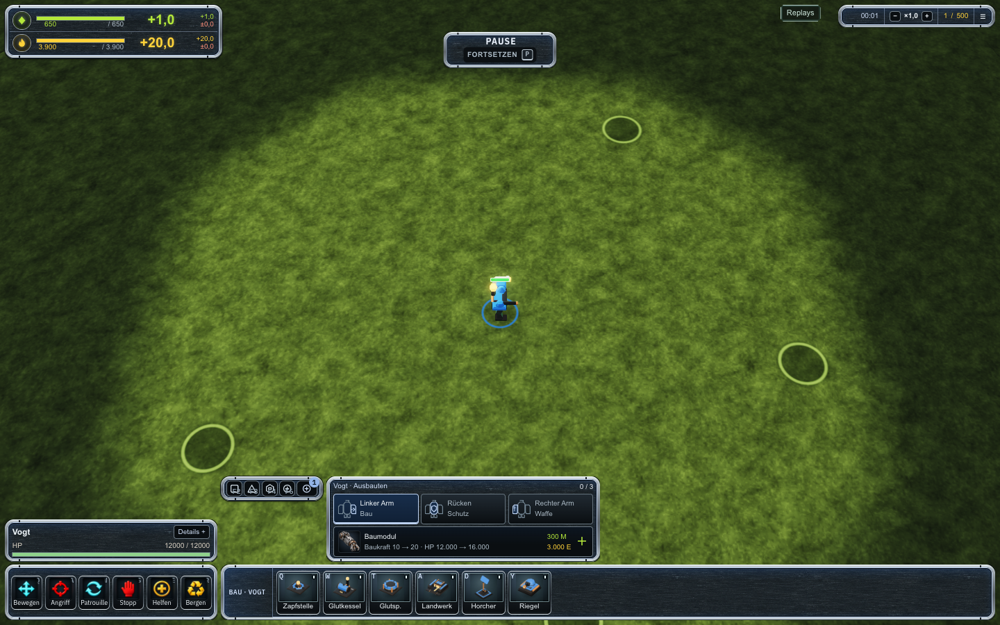
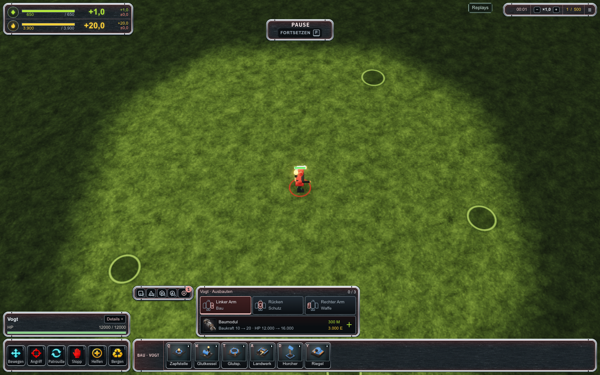
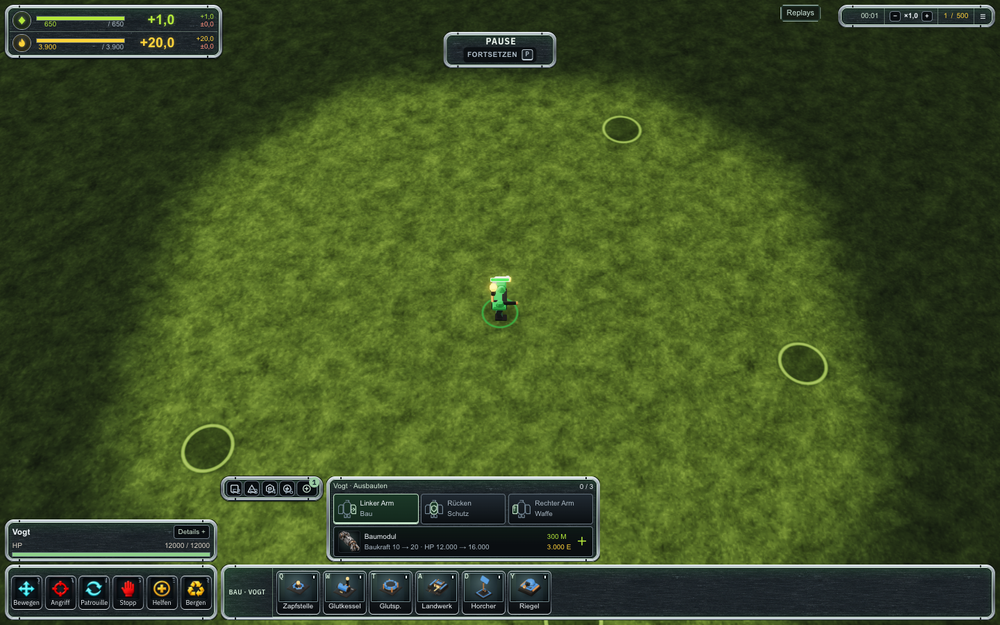
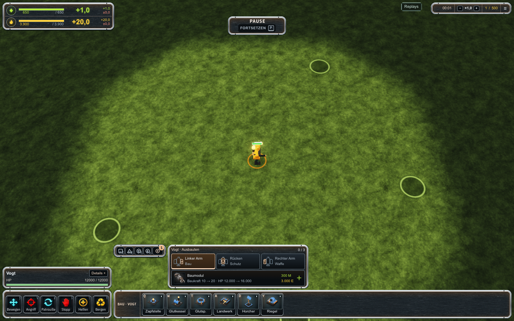
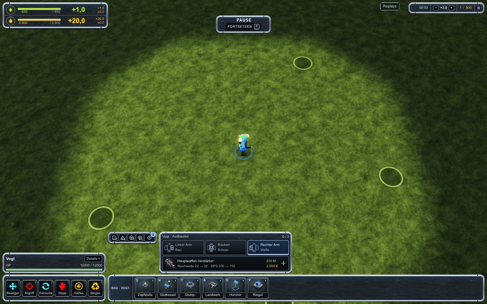
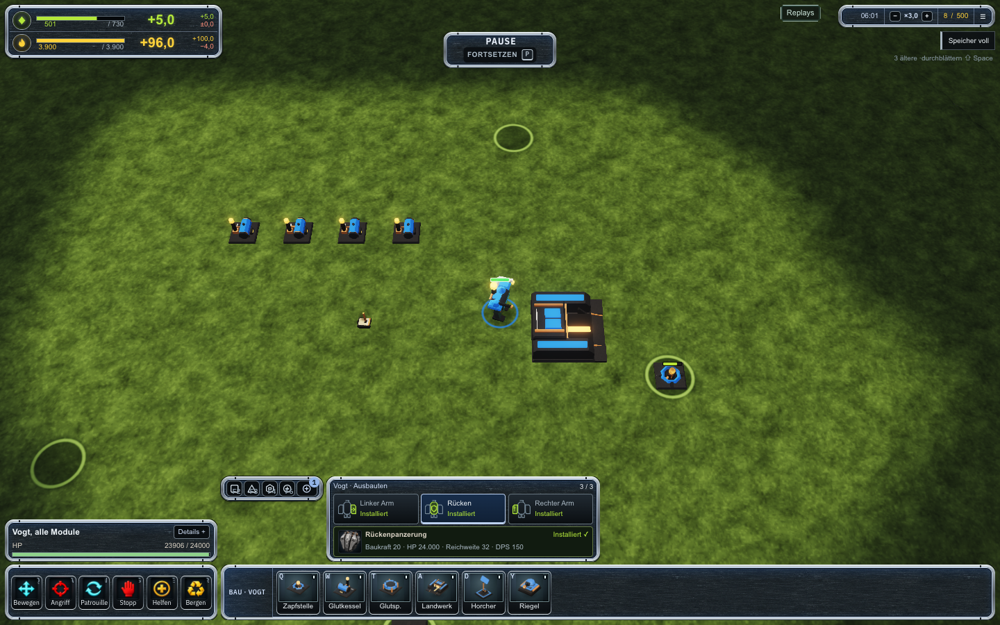
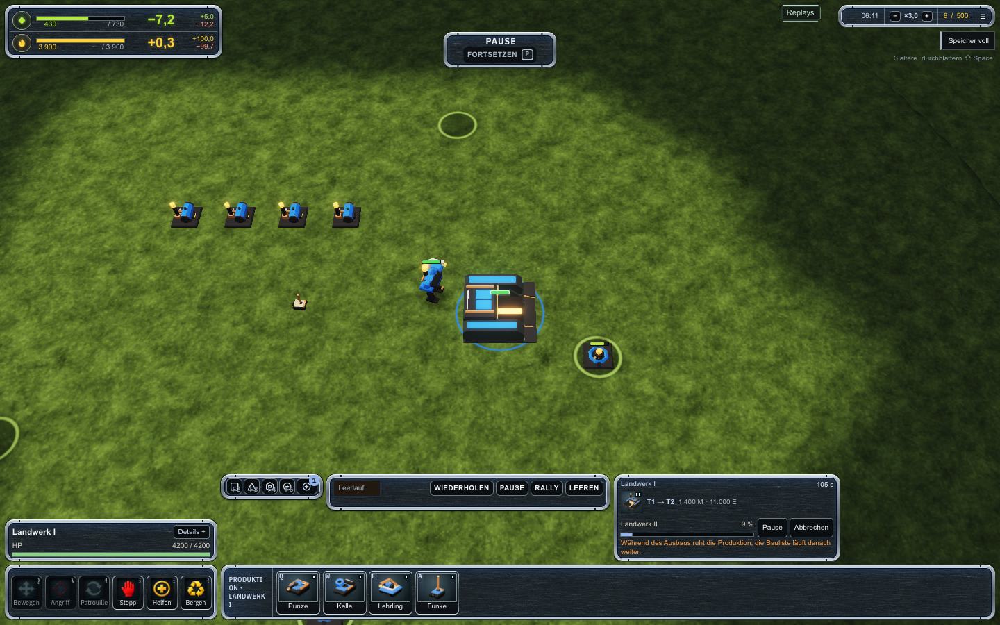
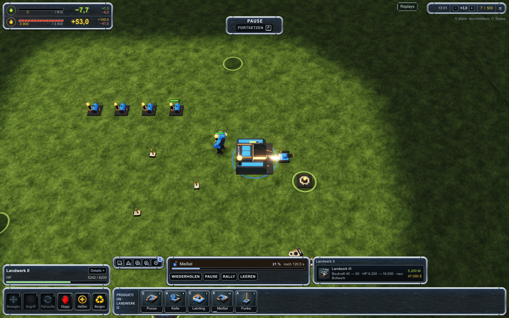

# Icons und Armeefarben

Ausgeliefert auf [faf.logge.top](https://faf.logge.top/?menu=1), Spielbuild `898000c4970c`.
Die im Gefechtsmenü gewählte Farbe färbt Rahmen, aktive Bedienflächen, Überschriften,
Ausbauplätze und Auswahlmarkierungen. Der Renderer verwendet dieselbe Palette für
die Einheiten und ihre Auswahlringe. Masse bleibt grün, Energie gelb; Angriff und
Stopp behalten Rot. Die dunklen Metallflächen bleiben lesbar.

Die HUD-Farbe bleibt auch in den Teamfarben-Modi Beziehung und Farbsehschwäche die
gewählte Armeefarbe. Beobachter verwenden neutrales Grau. Alte Aufnahmen enthalten
keine Farbauswahl und verwenden deshalb die vorhandene Palette je Armee.

## Artwork

- Sechs originale ImageGen-Befehlsbilder: Bewegen, Angriff, Patrouille, Stopp, Helfen
  und Bergen. Die vorhandenen Beschriftungen, Shortcuts und Eingaben bleiben am Button.
- Drei originale ImageGen-Komponentenbilder für das ACU-Baumodul, den
  Hauptwaffen-Verstärker und die Rückenpanzerung. Die drei Platz-Schemata identifizieren
  weiterhin linken Arm, Rücken und rechten Arm.
- 17 neu gerenderte Bau- und Produktionsbilder aus den tatsächlichen Modellen,
  mit größerer Silhouette, weicherer Beleuchtung, höherer Auflösung und vollständigem
  Bildausschnitt. Die Bildüberarbeitung verändert die Modellgeometrie nicht.

Alle neun generierten Bilder stammen aus einzelnen Aufrufen des eingebauten
`image_gen`-Tools mit transparentem Hintergrund. Die Originale sind im Repository
erhalten; das Spiel lädt nur die kompilierten 128-Pixel-WebP-Dateien. Die genauen
Prompts und Dateihashes sind dokumentiert:

| Assets | Ausgelieferte Dateien | Prompts und Originale |
| --- | --- | --- |
| Befehle | `apps/game/src/hud/assets/command-art/*-v1.webp` | [Generierungsbeleg](../../../apps/game/src/hud/assets/command-art/generation-v1.json), [Anleitung](../../../apps/game/src/hud/assets/command-art/README.md) |
| ACU-Module | `apps/game/src/hud/assets/enhancement-art-v1/*-v1.webp` | [Promptset](../../../content/ui/enhancement-art-v1/prompts.json), [Anleitung und Originale](../../../content/ui/enhancement-art-v1/README.md) |
| Bau und Produktion | `apps/game/src/hud/assets/build-icons/*.png` | [Manifest der echten Modelle](../../../apps/game/src/hud/assets/build-icons/manifest.json) |

## Öffentliche Spielscreens

Diese Bilder stammen aus dem ausgelieferten Spiel, jeweils nach nativer Bedienung.

## Prüfung

Typprüfung, Lint, Abhängigkeitsgrenzen und Produktionsbuild bestehen. Drei betroffene
Vitest-Dateien bestehen mit 18 Fällen. Der native Commander-Ausbau besteht in
Chromium, Firefox und WebKit. Die vier Farben bestehen in allen drei Browsern,
einschließlich tatsächlicher CSS-Farben, Bilddekodierung, kompakter Dock-Geometrie
und unveränderter Ressourcen- und Warnfarben: [12 Browserfälle](browser-checks.json).
Der Test wartet auf das vollständige Entfernen des Lade-Overlays, bevor er native
Canvas-Eingaben sendet.

Der öffentliche Build besteht die vier Farbfälle und den regulär bezahlten Ausbau:
drei Commander-Module, zwei Extraktoren, vier Generatoren, eine Fabrik, Ausbau auf T2,
Pause, Fortsetzen und T2-Produktion. 56 Screenshots und 56 Layoutprüfungen decken
1440×900, 1280×720, 1024×768 und 800×600 ab. Der höchste Desktop-Dock misst 209,77 Pixel.
Die Aufnahme bleibt untainted. Es gibt keine Browser-, HTTP-, Host- oder Layoutfehler
und keine Lautsprecher- oder blockierten Audioverbindungen. Alle Tests installieren
die stumme Ausgabe vor der Navigation. [Öffentlicher Prüfbeleg](verification.json).

Die Simulation bleibt `faf-sim/ms6.4-commander-enhancements`, Hash `0x02629d13`.
Container `flow-and-fire-game-1` läuft gesund als `node`, mit schreibgeschütztem Root
und null Neustarts. Das bestehende Archiv älterer Spielbuilds bleibt erhalten.
