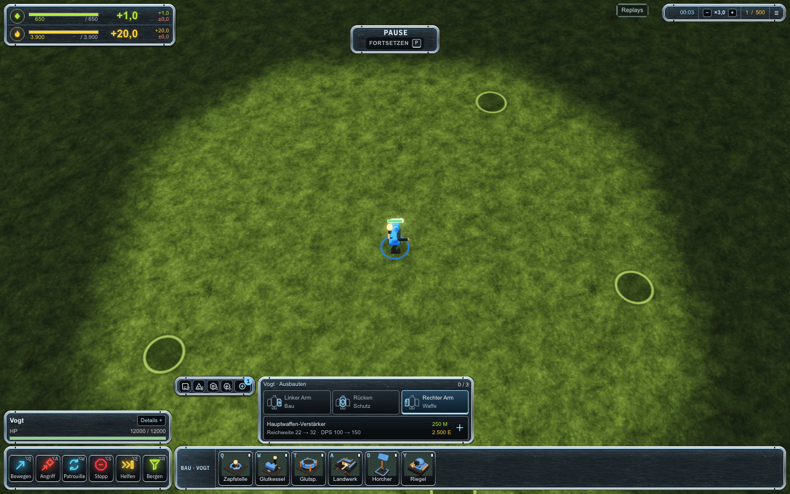
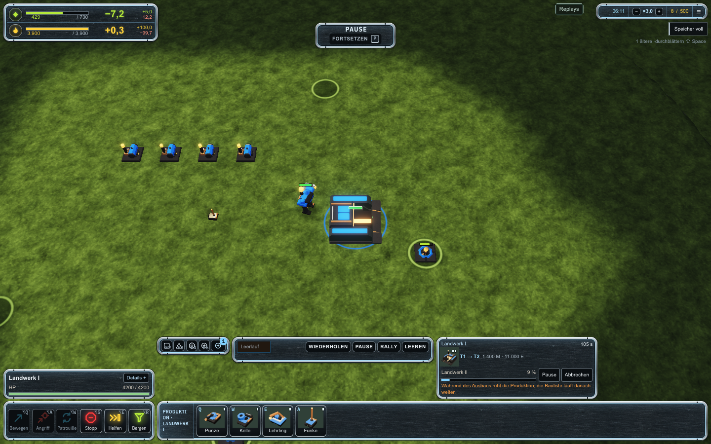

# Rundere HUD-Rahmen

Die Rahmen verwenden echte Rundungen mit einem konzentrischen inneren Rand. Die vorherigen abgeschnittenen Ecken und diagonalen Zierlinien entfallen. Metallkante, dunkle Fläche und dezente blaue Innenkante folgen derselben Kurve. Bau- und Befehlsbuttons, ACU-Plätze und Fabriksteuerung erhalten passende kleinere Radien.

## Vergleich

Vorher, öffentliche Version `eba29249180c`:

Nachher, öffentliche Version `fe3c4b7670eb`:

## Prüfung

Der native Gefechtsablauf wurde zuerst lokal an vier Fenstergrößen geprüft: 56 Screenshots und Layoutprüfungen, keine Browser-, HTTP-, Host- oder Layoutfehler. Die ACU-Module und der Fabrikausbau werden regulär bezahlt. Die Audioausgabe hat keinen Lautsprecheranschluss. Produktionsbuild und `git diff --check` bestanden.

Der gleiche Ablauf besteht auch im öffentlichen Build `fe3c4b7670eb`: 56 Aufnahmen an vier Fenstergrößen, keine Browser-, HTTP-, Host- oder Layoutfehler, keine Lautsprecherverbindung. Die oben gezeigten Bilder stammen aus diesem öffentlichen Durchlauf. Der höchste Desktop-Dock (ab 1024 Pixel Fensterbreite) misst 209,77 Pixel. [Kompakter Prüfbeleg](verification.json). Container `flow-and-fire-game-1` läuft gesund mit null Neustarts.

Die Änderung betrifft ausschließlich das HUD-Stylesheet. Der sichtbare Rahmen wird durch Pseudoelemente gezeichnet, damit Detailansichten und Tooltips weiterhin außerhalb der Panelgrenzen erscheinen können.
