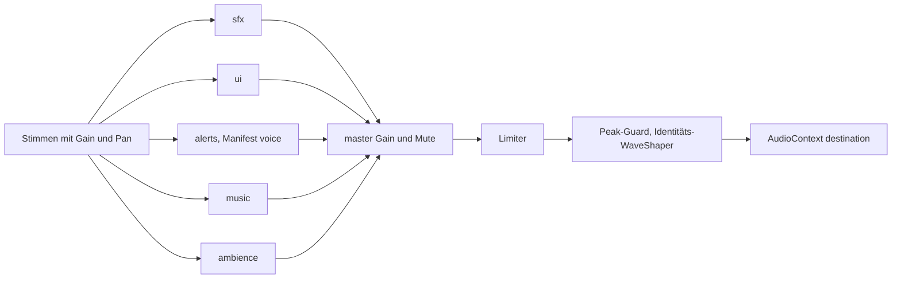

# TRACK-AUDIOENG: Audio vor MS5

Stand 2026-09-29. Kanonische Arbeitskopie: `flow-and-fire`. Das Blatt-Paket `@faf/audio` ist als Präsentationssystem umgesetzt. Es verändert keinen Sim-Zustand und importiert kein anderes Workspace-Paket. Die einzige Laufzeitabhängigkeit ist `opus-decoder`, als dynamisch geladener WASM-Fallback. Die Browser-Demo liefert die eigenständige Abnahmeoberfläche.

Die automatisierten Echtzeit-Tests und Benchmarks leiten den unveränderten Audio-Graph in eine MediaStream-Ausgabe ohne Lautsprecherverbindung. Stimmen, Mixer, Prioritäten und Unlock bleiben aktiv; die Engine wird nicht logisch stummgeschaltet. OfflineAudioContext prüft weiterhin die tatsächlich gerenderten PCM-Puffer. Die manuell gestartete Demo verwendet ihre normale Ausgabe.

## API und Struktur

Öffentliche Verträge stehen in `packages/audio/src/types.ts` und `ports.ts`. `createAudioEngine({baseUrl, manifest?, visualName?, eventTypes?, onJumpTo?, onAlert?, settingsStore?})` verbindet die Module. Die Fassade bietet `unlock`, `load`, `setListener`, `setSimSpeed`, `handleEvents`, `play`, `playUi`, `setLoop`, `alert`, `jumpToLastAlert`, `update`, `stats`, `resetStats` und `dispose`. Einstellungen sind über `engine.settings.get/set/subscribe` zugänglich.

| Modul | Aufgabe |
|---|---|
| catalog | Manifestprüfung, Fraktionslookup, Variantenpuffer |
| decode, loader | WebM/Opus-Demux, Dekodierkette, priorisierte Ladeaufträge |
| mixer, settings | Busse, Lautstärkekurve, Rampen, Persistenz, Ducking, Limiter |
| voices | Budget, Cooldown, Varianten, Stealing, kurze Tails, keyed Loops |
| spatial | Kamerapan, Distanz, Höhe, Culling |
| events, router | validierte Mappingdaten, EventReader-Vertrag, Aggregation, subTick |
| alerts | Priorität, Wiederholintervalle, Ortsausnahme, Verlauf und Kamerasprung |
| unlock, engine | Nutzergeste, Suspend/Re-Lock, Komposition und Messung |

Importe aus Apps verwenden `@faf/audio` oder `@faf/audio/<modul>`. Im Paket sind Importe relativ. Die Engine hängt nie von protocol oder sim ab.

## Architektur

Die Kategorie- und Sound-Limits stammen aus dem Manifest, das globale Budget beträgt 32 logische Stimmen. Eine höhere Priorität darf die leiseste niedrigere Stimme verdrängen. Gestohlene Stimmen bleiben höchstens 12 ms als begrenzte Ausblend-Tails im Graph. Varianten vermeiden direkte Wiederholung und erhalten bis zu ±3 % Tonhöhenvariation. Loops verwenden Manifest-Sekunden, sodass resampelte Puffer die gleiche Zeitspanne behalten.

Die Dekodierung versucht `decodeAudioData`, dann WebCodecs, dann `opus-decoder`. Firefox lieferte bei sieben geprüften Dateien einen terminalen PCM-Frame weniger. Die native Kette normalisiert ausschließlich eine Abweichung von ±1 Frame ohne Verschiebung oder Reskalierung: vorhandene Samples werden kopiert, ein fehlender Endframe ist Null, ein überzähliger Endframe entfällt. Größere Unterschiede werden nicht normalisiert und bleiben durch die dokumentierte Native-Toleranz sowie den strikten Browser-Pfadvergleich sichtbar. Ladefehler betreffen den einzelnen Sound. Ein Master-Kompressor mit −6 dB Schwelle und ein nachgeschalteter Identitäts-WaveShaper begrenzen das Summensignal. Die echte 32-Stimmen-Prüfung zeigte zuvor in Chromium und WebKit einen Peak von 1,17267 bei −3 dB: der Kompressor allein besitzt keine feste Peakgrenze. Die zusätzliche Reserve reduziert Transienten, die unveränderte Kennlinie des Peak-Guards begrenzt nur Werte jenseits von ±1. Oversampling bleibt aus, um Filterüberschwingen zu vermeiden. Im Fake-Kontext bleibt die Kompressorprüfung bestehen; der Peak-Guard nutzt einen lokal definierten optionalen Port und wird in den realen Browsern geprüft. Alerts ducken sfx und den Musik-/Ambience-Bereich. Unräumliche UI, Ack, Alerts, Musik und Ambience bleiben unabhängig vom Kamerapan; bei Alerts bleibt die Position als Sprungziel erhalten.

Die Engine beginnt gesperrt. Der erste explizite Klick ruft `unlock()` auf. Gesperrte Kampfereignisse werden verworfen. Suspend sperrt erneut. Quittungen über `playUi` starten synchron und können bei vollem Budget niedrigere Prioritäten verdrängen. `baseLatencyMs` und `outputLatencyMs` melden Browserfelder, keine gemessene gesamte Geräte-Reaktionszeit.

## Eventdaten

`events/default-event-map.json` und `sound-map.ts` ordnen Waffen-Refs, Einschlagflächen, Größenklassen und Client-Sounds zu. `events/kinds.ts` enthält die vorläufige Nummerntabelle und Feldsemantik. AudioEventSource ist strukturell kompatibel mit den Event-Accessoren des FrameReader; die Typtests benötigen keinen Import aus protocol. Positionen sind Q20.12, `subTick` ist ein Bruchteil eines 10-Hz-Ticks.

Alle 101 Klangbank-IDs sind Eventmapping, Client-API oder einem begründeten späteren Meilenstein zugeordnet. Die Roster-Tests prüfen 27 Waffen-Refs einschließlich Aliase. MS5-Decode-Tests prüfen alle Varianten der 17 dafür vorgesehenen Sounds.

## Lokal gemessene JS-Zeiten

Die Maschine ist ein Apple M5 Pro. Die Werte belegen lokale Laufzeiten, keinen Referenz-Laptop. Node verwendet FakeAudioContext und den echten Engine-Hot-Path mit echter Manifestpolicy. Die drei Browser messen den echten AudioContext und die vollständige Klangbank. Engine-Zeit und Szenario-Erzeugung werden getrennt erfasst. Das harte Zeit-Gate wird nur mit `FAF_AUDIO_PERF_GATE=1` aktiviert.

<!-- bench:audio-node:start -->
| Schüsse/s | Lauf | p50 ms | p95 ms | p99 ms | Stimmen | Drops | Steals |
|---|---|---|---|---|---|---|---|
| 200 | 1 | 0.0002 | 0.0279 | 0.0866 | 27 | 3859 | 1679 |
| 200 | 2 | 0.0002 | 0.0205 | 0.0419 | 27 | 3883 | 1659 |
| 200 | 3 | 0.0001 | 0.0212 | 0.0531 | 27 | 3884 | 1672 |
| 400 | 1 | 0.0001 | 0.0225 | 0.0502 | 27 | 6824 | 1830 |
| 400 | 2 | 0.0001 | 0.0257 | 0.0677 | 27 | 6822 | 1836 |
| 400 | 3 | 0.0001 | 0.0204 | 0.0358 | 27 | 6929 | 1817 |
<!-- bench:audio-node:end -->

<!-- bench:audio-browser:start -->
| Browser | Schüsse/s | p50 ms (Bereich) | p95 ms (Bereich) | p99 ms (Bereich) | Stimmen | Timer ms | Dekodierpfad |
|---|---|---|---|---|---|---|---|
| chromium | 200 | 0.0050 bis 0.0050 | 0.2650 bis 0.3300 | 0.4600 bis 0.5250 | 27 | 0.0050 | {"native":246,"webcodecs":0,"wasm":0} |
| chromium | 400 | 0.0050 bis 0.0050 | 0.2800 bis 0.3150 | 0.4500 bis 0.5300 | 27 | 0.0050 | {"native":246,"webcodecs":0,"wasm":0} |
| firefox | 200 | 0.0000 bis 0.0000 | 0.1800 bis 0.1800 | 0.2600 bis 0.3400 | 27 | 0.0200 | {"native":246,"webcodecs":0,"wasm":0} |
| firefox | 400 | 0.0000 bis 0.0000 | 0.2000 bis 0.2000 | 0.3000 bis 0.3800 | 27 | 0.0200 | {"native":246,"webcodecs":0,"wasm":0} |
| webkit | 200 | 0.0000 bis 0.0000 | 0.2000 bis 0.2000 | 0.2600 bis 0.3200 | 27 | 0.0200 | {"native":246,"webcodecs":0,"wasm":0} |
| webkit | 400 | 0.0000 bis 0.0000 | 0.2200 bis 0.2600 | 0.3000 bis 0.4600 | 27 | 0.0200 | {"native":246,"webcodecs":0,"wasm":0} |
<!-- bench:audio-browser:end -->

## Speicherbilanz

Das Manifest enthält 101 Sounds mit 246 Varianten. Die PCM-Bilanz bei 48 kHz beträgt nach Manifestlängen 82.650.668 Bytes (78,82 MiB, Float32 × Kanäle × Samples). Browserwerte werden als `decodedBytes` im HUD und Benchmark ausgewiesen; native Resampling-/Längenabweichungen können die tatsächliche Bilanz verändern. Die Serverdateien bleiben Opus/WebM.

## Abnahme

| Kriterium | Stand | Beleg |
|---|---|---|
| Blatt-Paket ohne Sim-/Workspace-Abhängigkeiten | umgesetzt | package.json, Root dependency-cruiser |
| Busse, Kurve, Settings, Persistenz, Mute, Ducking | umgesetzt | test/mixer, test/settings, test/engine |
| 32 Stimmen, Kategorie-/Sound-Limits, Cooldown, Stealing, Tails | umgesetzt | test/voices, limits.property.test.ts, test/engine |
| Loop-Sekunden und keyed Loops | umgesetzt | test/voices/loop-set.test.ts, Browser loop |
| Lookup und vollständige Mappingabdeckung | umgesetzt | test/catalog, test/events/coverage.test.ts, roster.ts |
| EventReader, subTick, Aggregation, allokationsarmer Router | umgesetzt | contracts.test.ts, test/router mit 100000 Events |
| Kamera, Rotation, Zoom, Culling | umgesetzt | test/spatial, Browser pan |
| Alert-Regeln und Sprung | umgesetzt | test/alerts, Browser demo |
| Native/WebCodecs/WASM, Länge, Lazy-Loading und Fehlerisolierung | umgesetzt | test/loader, Browser decode |
| Unlock und Re-Lock | umgesetzt | test/unlock, test/engine, Browser Overlay-Klick |
| synchrone UI/Ack-Quelle | umgesetzt | test/engine, test/voices, Demo-Quittung |
| Gefecht-200 und reale Browser-Audiopipeline | 21/21 Browserfälle bestanden | Chromium, Firefox, WebKit; Offline-Peak/Längen und Demo |
| lokale p95 ≤ 0,5 ms | bestanden bei 200 Schüssen/s | Node 0,0205..0,0279 ms; drei Browser 0,18..0,33 ms, jeweils drei Läufe mit `FAF_AUDIO_PERF_GATE=1` |
| globale Checks ohne Regression | Root-Abschlussprüfung | pnpm typecheck/lint/test |

Die abschließende stumme Browserprüfung bestand 21/21 Fälle in 44,2 s. Der vollständige
Browser-Benchmark bestand 18/18 Fälle einschließlich der zusätzlichen 400-Schuss-Arbeitslast.
Die Engine blieb logisch aktiv, höchste beobachtete Stimmenzahl 27. Nullwerte im p50 liegen
unter der gemessenen Timerauflösung. Rohbericht: `apps/audio-demo/results/1790718101769.json`.
Screenshots und JSON-Berichte liegen in den git-ignorierten Ergebnisordnern.

## Integration in MS5

1. Engine im Präsentationsclient erzeugen. Die Klangbank als `/audio/` ausliefern; `apps/audio-demo/audio-assets.ts` ist die vorhandene Vite-Plugin-Vorlage, alternativ übernimmt die Assetpipeline denselben Vertrag.
2. `FrameReader` direkt an `engine.handleEvents(frameReader)` übergeben. Der Client liefert seine echte `eventTypes`-Tabelle und `visualName` aus `view.json`. Vorläufige Demo-IDs dürfen nicht stillschweigend als Protokoll-IDs verwendet werden.
3. Folgende Arten an die Protokoll-Eventliste anhängen. Die vollständige verbindliche Feldsemantik steht in `SIM_EVENT_KIND_INFO` in `packages/audio/src/events/kinds.ts`.

| Arten | Felder und Meilenstein |
|---|---|
| weaponFire | visual = Waffenref, pos = Mündung, handle = Einheit; MS5 |
| projectileImpact | visual = Waffenref, aux = Oberfläche, pos = Einschlag; MS5 |
| unitDeath, commanderDeath | aux = Größenklasse, flags = Struktur/Luft, pos = Todesort; MS5 |
| buildComplete, reclaimStart | pos/handle = Ziel, Strukturflag bei buildComplete; MS5 |
| factoryRollOff, unitRollOff | visual/pos/handle = Fabrik bzw. neue Einheit; MS6 |
| overchargeFire, tapshot | Tapshot-Waffenvisual, Energie/Schaden in aux; MS6 |
| buildStart, upgradeComplete, reclaimComplete | Baustelle, Struktur oder verbrauchtes Ziel; MS9 |
| radarContact | Kontaktvisual, pos, handle; MS9 |
| massStall, energyStall | flags bit7 unlocated, handle = Armee; MS9 |
| alert | aux = ALERT_KINDS-Index, pos = Sprungziel, bit7 ohne Ort; MS9 |
| shieldHit, shieldCollapse, shieldRestore | Schildvisual und Schildposition; MS13 |
| wreckDestroyed | Wrackvisual, pos, handle; MS14 |

4. Bei der ersten Nutzergeste `unlock()` aufrufen. Die Lebensdauer gehört zur Clientoberfläche; bei Abbau `dispose()` aufrufen.
5. Command-Builder startet die Ack-Quittung synchron mit `playUi`, während Kampfgeräusche ausschließlich aus Frames kommen. Keine Rückkopplung in Befehls-/Simdaten.
6. Kamera liefert `focusX/focusZ/height/viewHalfWidth/rightX/rightZ` an `setListener`, die Sim-Geschwindigkeit an `setSimSpeed`. Loops bleiben keyed und werden bei Ende mit `null` gestoppt.
7. P9 bindet die sechs Busregler und Mute an `engine.settings`; Alarmhistorie bindet `onAlert`, `onJumpTo` und `jumpToLastAlert`. Diese reale Spielintegration ist ein Folge-Meilenstein.

## Abweichungen und Grenzen

Die ursprünglichen Pläne verweisen auf getrennte Worktrees; diese Umsetzung erfolgt im gemeinsamen Root. Änderungen anderer Tracks in Sim-/Render-/Client-Pfaden sind keine Audio-Abhängigkeit oder Audioänderung. Die Demo ist ein Audio-Szenario mit visuellen Fronten und kein Sim-Spiel. Node-Knoten sind Fakes; die reale Audiowirkung wird durch OfflineAudioContext geprüft. Das Performance-Gate ist opt-in, Messwerte bleiben im Bericht sichtbar. Weitere Sprach-Alerts und finale Protokoll-IDs gehören in die angegebenen Meilensteine.
