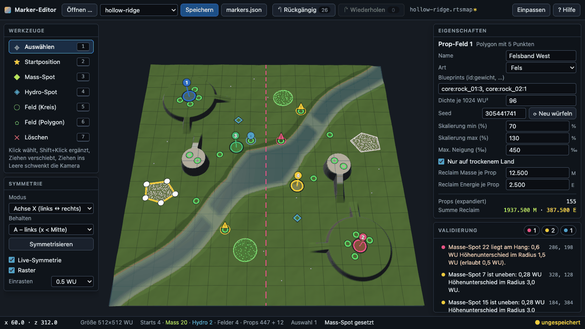
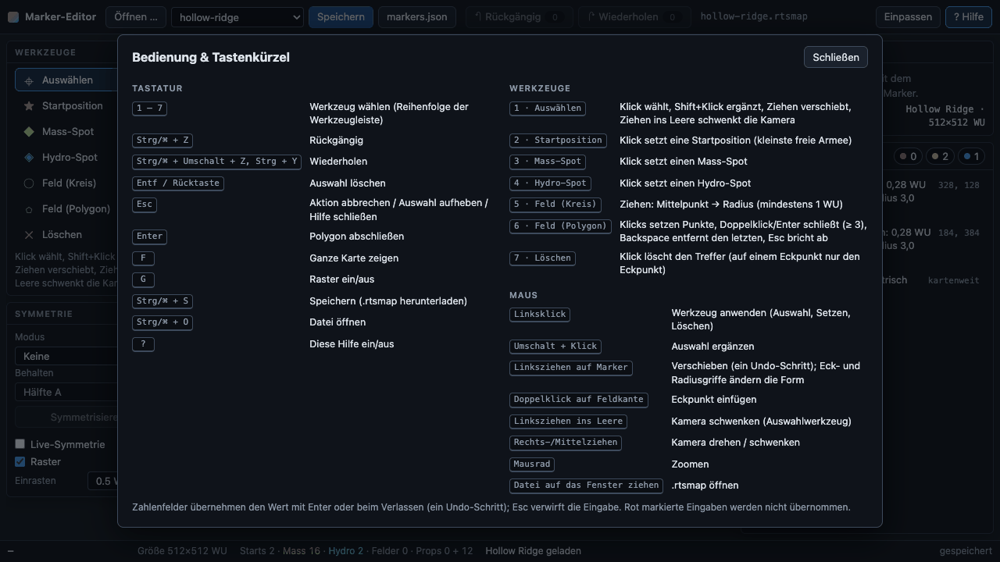
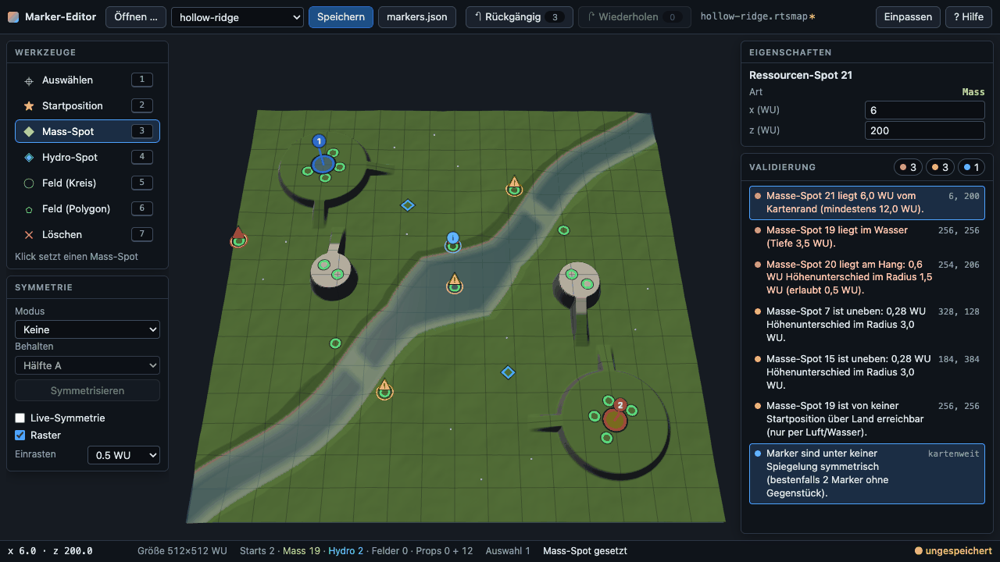
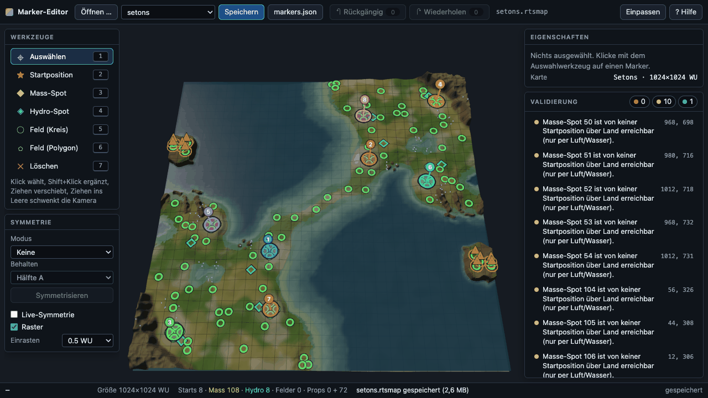

# Vorarbeits-Track TRACK-EDITOR – Marker-Editor (Feature M12 vorgezogen)

Stand: 2026-09-30 · Branch `track-editor` (Worktree `flow-and-fire/.worktrees/faf-editor`, Basis `2fc956c`) ·
Pakete P0–P7 · kein Meilenstein aus PLAN §5.2, sondern ein paralleler Vorarbeits-Track zu MS3.

> Pfad-Hinweis: Die Aufträge nennen `/Users/logge/Documents/Projects/faf-editor`. Diesen Ordner gibt es nicht;
> der Worktree des Branches `track-editor` liegt unter `/Users/logge/Documents/Projects/flow-and-fire/.worktrees/faf-editor`.
> Alle Pakete haben dort gearbeitet.

## Ergebnis in Kürze

- **`apps/marker-editor`** (Vite 8, three.js, Preact + `@preact/signals`): lädt `.rtsmap` (Kartenauswahl, `?map=`,
  Datei-Dialog, Drag & Drop), zeigt das Terrain (Splat-Farben, Wasser, Licht, 32-WU-Raster) und bearbeitet
  Startpositionen, Mass-/Hydro-Spots und **Prop-Felder** (Kreis/Polygon mit Dichte, Seed, Reclaim-Wert …).
  Symmetrie-Werkzeuge (Punkt, Achse X/Z, Diagonale, Gegendiagonale; „Symmetrisieren“ und Live-Symmetrie),
  Validierung mit festen Codes und klickbarer Liste, Undo/Redo (Limit 500, Drag = ein Schritt), Export als
  `.rtsmap`, `markers.json` und `editor.json` (Marker-Overlay der Kartenquelle, übersteht `pnpm maps`).
- **Kartenformat additiv erweitert:** optionaler Chunk **`PFLD`** (Prop-Felder) zwischen `PROP` und `PREV`,
  deterministische Integer-Expansion in `@faf/formats` (Algo v1, Version steht in der Datei). Bestehende Karten bleiben bytegleich, ihre
  mapSimHash-Goldens unverändert (hollow-ridge `0x90ec94f0`, tessera `0x22cb60a8`, braidwater `0xeeaec694`,
  setons `0x52eccf92`).
- **Roundtrip bewiesen:** Editor → Datei → Spiel-Loader (`readRtsMap`, `ClientMap.fromBytes`, sim-host `resolveMap`/`SimCore`)
  → Datei ist bytegleich – in Node (Vitest) und aus dem echten Browser-Download (Playwright, 3 Browser).
- Keine Änderung in `packages/sim|nav|render|client`, `apps/game`, `content/maps`
  (`git diff --exit-code 2fc956c -- …` leer).

### Review-Korrekturen (2026-09-30)

| Befund | Korrektur |
|---|---|
| Undo/Redo auf QWERTZ vertauscht (`code` statt Zeichen) | Buchstabenkürzel über `KeyboardEvent.key`, `code` nur Rückfall (TE-10); Unit- und E2E-Test für QWERTZ |
| Gesten nur in Node belegt | `gestures.spec.ts` mit echten Mausgesten, je ein Undo-Schritt; Abnahmezeile 6 korrigiert |
| Eigene Passierbarkeit ≠ Nav | Zellregel in `@faf/rules` (TE-7), Editor und Prop-Feld-Expansion nutzen sie, Paritätstest gegen MS3-Nav: 0 Abweichungen |
| `pnpm maps` überschreibt Editor-Änderungen | `editor.json`-Overlay, von mapc angewandt (TE-8), Test Editor-Export → Quelle → Compile |
| Algo-Version nicht in der Datei | PFLD-Kopf `u16 algoVersion` + `u16 fieldCount`, `RtsMap.propFieldAlgo`, unbekannte Versionen abgelehnt (TE-2) |
| Datei-Dialog/Drop nicht per E2E | `files.spec.ts` (filechooser, `Strg/⌘+O`, DataTransfer-Drop, Endungsfilter) |
| Vertragstypen mehrfach kopiert | einzige Definition `src/model/types.ts` (MarkerRef, SymmetryMode, EditorIssue, Validator, `sameRef`, `refIn`, `MIRROR_MODES`); Validierung nutzt `mirrorPoint` des Modells; `PROP_ID_RE` aus `@faf/formats` in UI und mapc |
| Demo-Seiten und zweite SHA-256 im Build | `overlay-demo`/`ui-preview` und `io/sha256.ts` entfernt; Hook `exportHash()` = xxHash32 (TE-9) |



## Bedienung

| Befehl | Zweck |
|---|---|
| `pnpm editor` | Dev-Server (Vite, Port 5220, weicht bei Belegung aus); `http://localhost:5220/?map=setons` |
| `pnpm --filter @faf/marker-editor build` | Produktions-Build nach `apps/marker-editor/dist` (inkl. `maps/*.rtsmap`) |
| `pnpm test:e2e:editor` | Build + Playwright (`apps/marker-editor/playwright.config.ts`, Port `FAF_E2E_PORT` oder 4783, workers 1, chromium/firefox/webkit) |
| `pnpm vitest run apps/marker-editor packages/formats` | Unit-/Komponententests des Tracks |
| `pnpm --filter @faf/formats bench` · `pnpm --filter @faf/marker-editor bench` | Benchmarks (nur Messung, kein Gate) |

Maus/Tastatur (vollständig im Hilfe-Overlay, Taste `?`): Werkzeuge `1`–`7` (Auswählen, Start, Mass, Hydro, Feld Kreis,
Feld Polygon, Löschen); Linksklick wendet das Werkzeug an, Linksziehen auf Markern verschiebt (ein Undo-Schritt),
Ziehen ins Leere schwenkt; rechte/mittlere Taste schwenkt, Alt+Links bzw. `Q`/`E` dreht, Rad zoomt zum Cursor, `WASD`
schwenkt. `Strg/⌘+Z`, `Strg/⌘+Umschalt+Z`, `Strg+Y`, `Entf`, `Esc`, `Enter` (Polygon schließen), `F` (Einpassen),
`G` (Raster), `Strg/⌘+S` (Speichern = Download), `Strg/⌘+O` (Öffnen). Zahlenfelder übernehmen mit Enter/Verlassen
(je ein Undo-Schritt), ungültige Eingaben werden rot und nicht übernommen.



## Architektur

```
apps/marker-editor/src
├── view/      three.js-Terrain-Ansicht (TerrainView, CameraRig, Geometrie, Wasser, Raster, Licht)      P1
├── model/     EditorDocument (unveränderlich), Ops mit exakter Inverse, History, Symmetrie, markers.json P2
├── app/store  EditorStore (@preact/signals, DOM-frei): Befehle, Snap, Live-Symmetrie, Validator-Hook      P2
├── validate/  TerrainAnalysis (Zellregel aus @faf/rules = Nav, Clearance, Komponenten) + Regeln         P3
├── overlay/   MarkerOverlay (Starts, Spots, Felder, Props, Griffe, Issues, Symmetrieachse, Draft)       P4
├── pick/      TerrainPicker (Strahlmarsch auf sampleHeightRaw), worldToClient, hitTestMarkers           P4
├── app/       EditorController (Werkzeug-FSM), Keymap, Test-Hooks, ViewMarkers-Adapter                  P5
├── io/        EditorSession (Laden/Speichern/Exporte), Datei-Dialog, Drag & Drop                          P5
└── ui/        Preact-Panels: Topbar, Werkzeuge, Symmetrie, Eigenschaften, Validierung, Statusleiste, Hilfe P6
```

- **three.js statt `packages/render`/Spiel-`TerrainView`.** PLAN §3.2 erlaubt three.js in Tools. `packages/render`
  wird parallel in MS3 umgebaut und ist für die Spielkamera/Instancing ausgelegt; der Editor braucht dagegen
  eigene Overlays ohne Tiefentest, exaktes Picking gegen `sampleHeightRaw` und Panels. Eine Kopplung hätte den
  Track an MS3 gebunden. Die Terrainfarben sind eine vereinfachte, einfarbige Variante der Auto-Splat-Logik.
- **Abhängigkeiten** (dependency-cruiser-Regeln `marker-editor-deps`, `marker-editor-npm-deps`): `src/` importiert
  nur `@faf/formats`, `@faf/fixed`, `@faf/rules`, `@faf/protocol` sowie `three`, `preact`, `@preact/signals`.
  `@faf/client`/`@faf/sim-host` sind reine devDependencies für die Roundtrip-Tests.
- **Koordinaten** in Daten, Store und Format immer Fx raw (Q20.12, 1 WU = 4096, Integer); Umrechnung in WU nur an
  der UI-/three.js-Grenze. Modell und Validierung sind deterministisch (kein `Math.random`/`Date`).
- **Freie Kartenfläche (P7):** Die Panels verdecken die Canvas-Ränder. `TerrainView.setViewInsets` verschiebt das
  Projektionszentrum per Kamera-View-Offset (gleicher Maßstab) in die Mitte der freien Fläche; `fitCamera`
  berücksichtigt die freie Breite/Höhe. Picking/`worldToClient` bleiben exakt, weil sie die Kameramatrizen nutzen.
- **Test-Hooks:** `window.__editor` (ready, mapName, load, loadBytes, exportBytes, exportHash (xxHash32), counts, issues,
  worldToClient, clientToWorld, undoDepth, redoDepth, mapSimHash, renderStats, waitForRender, store) und
  `window.__editorView` (P1-Vertrag).

## Kartenformat: Chunk PFLD (Prop-Felder)

**Ort und Präsenz:** `RTSMAP_CHUNK_ORDER = META, HGT , SPLT, PROP, PFLD, PREV`. `RtsMap.propFields?` ist optional;
ohne Chunk fehlt die Eigenschaft ganz, `writeRtsMap` schreibt PFLD genau dann, wenn `propFields !== undefined`.
Dateien ohne PFLD bleiben dadurch bytegleich. Der Editor legt PFLD an, sobald ein Feld existiert, und lässt ihn
weg, wenn die Quelldatei keinen hatte und alle Felder wieder gelöscht sind.

**Binärlayout** (little endian, `pad4` relativ zum Payload-Anfang):

```
u16 algoVersion (Expansionsverfahren, ∈ PROPFIELD_ALGO_VERSIONS, sonst Lesefehler) | u16 fieldCount (0..256)
je Feld:
  u16 nameLen | name (UTF-8, 1..64 B, keine Steuerzeichen) | pad4
  u8 kind (0 tree, 1 rock, 2 wreck) | u8 shapeKind (0 Kreis, 1 Polygon) | u16 flags (bit0 dryOnly, Rest 0)
  u32 seed | u16 densityPerKWu2 (1..4096) | u16 maxSlopePermille (0 = beliebig)
  u16 scaleMinPermille | u16 scaleMaxPermille (1..65535, min ≤ max)
  u32 reclaimMassMilli | u32 reclaimEnergyMilli
  u16 entryCount (1..16) | u16 pointCount (Kreis 0, Polygon 3..64)
  Einträge: u16 idLen | id (PROP_ID_RE, ≤ 128 B) | pad4 | u16 weight (1..65535) | u16 reserved
  Form: Kreis i32 x, i32 z, i32 r (r ∈ [4096, sizeWu·4096]) · Polygon pointCount × (i32 x, i32 z)
```

Der Leser prüft Längen, Padding, reservierte Bits und Enums; `validatePropFields` prüft alle Invarianten
(einfache Polygone ohne Kreuzung/Berührung, Punkte in der Karte, Budget `props + Expansion ≤ MAP_MAX_PROPS = 65.536`,
Summe der Kandidatenzellen ≤ `MAP_MAX_FIELD_CELLS = 2^21`). Maximal 256 Felder.

**Algo-Version (Review-Korrektur, DECISIONS TE-2):** Die Version steht im PFLD-Kopf und im Modell
(`RtsMap.propFieldAlgo`, `readRtsMap` setzt sie immer). Die Expansion wählt das Verfahren danach; neue Felder bekommen
`PROPFIELD_ALGO_VERSION` (heute 1), unbekannte Versionen lehnt der Leser ab. Ein geändertes Verfahren (z. B. die
symmetrische Expansion für MS8) wird Version 2 **zusätzlich** zu v1 – bestehende Karten behalten ihre Wälder.
Der Editor übernimmt die Version der geöffneten Datei, `markers.json`/`editor.json` tragen `propFieldAlgo`.

**Expansion (Algo v1, nur Integer, Lint `sim/determinism` grün):**
Zellgröße `cellRaw = isqrt(floor(2^34 / density))` auf einem globalen Gitter ab (0,0). Zeilenweise (z, dann x) über alle
Zellen, die die auf die Karte geklemmte Bounding-Box schneiden: `h1/h2 = rng32(seed, cz, cx, 1/2)`, Kandidat =
Zellursprung + `(h mod cellRaw)`. Verworfen außerhalb von Karte/Form (Kreis geschlossen `≤ r²`, Polygon halboffen per
Crossing Number), bei `dryOnly` unter/auf Wasserhöhe (nächster Stützpunkt), bei `maxSlope > 0` wenn die Neigung der
Zelle, in der der Kandidat liegt, `maxSlope/1000` übersteigt – `landCellSlopeRaw` aus `@faf/rules` (max − min der 4 Ecken,
dieselbe Neigung wie Nav und Editor, TE-7): verworfen gdw. `slopeRaw·1000 > maxSlope·4096`. Eintrag gewichtet über
`rng32(…,3) mod Σw`, `yaw = rng32(…,4) & 0xffff`, `scale = min + rng32(…,5) mod (max−min+1)`. Anzahl ≈ Dichte × Fläche
(Test ±15 %), Golden-Hash der Expansion `0x1cedb935` (380 Props).
Wegen des globalen Gitters erzeugt ein gespiegeltes Feld nur ein statistisch gleichwertiges, kein punktgenau
gespiegeltes Muster (Spiegelfelder bekommen `seed XOR 0x9e3779b9`).

**Hash-Regel:** `mapSimBytes` hängt nur bei vorhandenen **und** nicht leeren Feldern
`'PFLD' | propFieldsSimBytes` an (PFLD-Layout inkl. gespeicherter `algoVersion`, mit `nameLen = 0`). Ohne Felder oder mit
`[]` bleibt der Hash exakt wie bisher. Der Name ändert den Hash nicht, jeder Sim-Parameter und die Feldreihenfolge schon.
`mapSimData` ist unverändert – die Sim-Anbindung folgt in MS8/E8.

**mapc:** `markers.json` akzeptiert optional `propFields: [{ name, kind, shape: {circle:{x,z,r}} | {polygon:[[x,z],…]},
entries:[{id, weight?}], density, seed, scale?, maxSlope?, dryOnly?, reclaimMass?, reclaimEnergy? }]` (WU bzw. Dezimalwerte),
`propFieldAlgo?` und statt `mass`/`hydro` wahlweise die geordnete Liste `spots: [{kind, x, z}]`.
Ohne die Schlüssel bleibt die Ausgabe bytegleich; `pnpm maps` ist idempotent.

## Wem gehören die Marker? (`editor.json`, Review-Korrektur, DECISIONS TE-8)

Alle vier eingecheckten Karten sind prozedural: `pnpm maps` schreibt `content/maps/src/<name>/markers.json` aus
`mapgen*.ts` neu und kompiliert danach. Direkt ins `.rtsmap` gespeicherte Editor-Änderungen würde der nächste Lauf
überschreiben. Deshalb:

- **Generator** besitzt Terrain, Wasser, Licht, Strata, Props und `markers.json`.
- **Editor** besitzt Starts, Spots und Prop-Felder und exportiert sie mit dem Knopf **„editor.json“** als
  `content/maps/src/<name>/editor.json` (`{version, editorOverlay: 1, name, sizeWu, starts, spots, propFields?,
  propFieldAlgo?}`, WU-Dezimalwerte, Spot-Reihenfolge erhalten). Kein Skript schreibt diese Datei.
- **mapc** (`compileMapSource`, CLI `--overlay`) ersetzt vor dem Kompilieren Starts/Spots/Felder aus `markers.json`
  durch die aus `editor.json` (Name und Größe müssen passen).

Arbeitsablauf für MS8-Prop-Felder auf bestehenden Karten: Karte im Editor öffnen → bearbeiten → „editor.json“ →
Datei nach `content/maps/src/<name>/` → `pnpm maps` → committen. Test `apps/marker-editor/test/model/editor-overlay.test.ts`
(alle 4 Karten): unverändertes Overlay → `compileMapSource` ist **bytegleich** mit dem eingecheckten `.rtsmap`;
bearbeitetes Overlay → alle Chunks außer `PREV` bytegleich mit dem Editor-Export, `mapSimBytes` gleich, erneuter
Export identisch (Fixpunkt), zweiter Compile identisch. `PREV` unterscheidet sich absichtlich: mapc zeichnet die
Vorschau mit den neuen Markern neu, der Editor reicht die alte durch.

## Validierung

Codes, Schwere und Schwellen (Defaults, `DEFAULT_VALIDATION_OPTIONS`):

| Code | Schwere | Bedingung |
|---|---|---|
| `start-count` | error / warning | < 2 Starts / Armeen nicht lückenlos 0..n−1 |
| `start-edge` · `spot-edge` | error | Start < 16 WU, Spot < 12 WU vom Kartenrand |
| `start-in-water` · `spot-in-water` | error | Terrain auf oder unter Wasserhöhe |
| `spot-not-flat` | error / warning | max. Höhenunterschied > 0,5 WU im Radius 1,5 WU / > 0,1 WU im Radius 3 WU |
| `start-not-flat` | warning | Bauplatz (Radius 8 WU) zu < 50 % passierbar |
| `spot-overlap` · `spot-close` | error / warning | zwei Spots < 2 WU / < 4 WU |
| `spot-on-start` | error | Spot < 4 WU von einem Start |
| `start-close` | error / warning | zwei Starts < 48 WU / < 96 WU |
| `start-unreachable` | error | Start nicht in der Land-Komponente mit den meisten Starts |
| `spot-unreachable` | warning | Spot in keiner Land-Komponente eines Starts (Insel) |
| `field-invalid` · `field-empty` | error / warning | Feld nicht expandierbar / expandiert zu 0 Props |
| `field-covers-spot` | warning | Feld-Props < 2 WU an einem Spot bzw. < 8 WU an einem Start |
| `prop-count` | error | PROP-Einträge + Expansion > 65.536 |
| `asymmetric` | info | erkannte Symmetrie-Modi bzw. Marker ohne Gegenstück (Toleranz 1 WU) |

Land-Passierbarkeit **wie die Nav des Spiels** (Review-Korrektur, DECISIONS TE-7): Zellen à 1 WU (PLAN §3.8), gesperrt
nach `@faf/rules` `isLandCellBlocked` (Kartenrand, Zellneigung max − min der 4 Ecken > 0,75, Tiefwasser in Zellmitte),
Clearance (Chebyshev, Chamfer) je Größenklasse, Komponenten in 8-Nachbarschaft ohne Eckenschneiden, Labels in
Scan-Reihenfolge (Editor-Label + 1 = Nav-Label). Geprüft wird Größenklasse 1 (Option `navClass`). Der Paritätstest
`test/validate/nav-parity.test.ts` vergleicht Passierbarkeit, Clearance und Labels aller drei Klassen auf den vier Karten
mit der MS3-Nav: `FAF_NAV_SRC=<ms3>/packages/nav/src/index.ts` → 4/4 grün, 0 Abweichungen; ohne Nav im Workspace wird er
als „skipped“ gemeldet und läuft nach dem Merge automatisch. Die Terrain-Analyse wird je Höhenfeld gecacht,
Feld-Expansionen je Feldobjekt. Die vier bestehenden Karten liefern **0 errors** (Warnungen: hollow-ridge 2×
`spot-not-flat`, setons 10× `spot-unreachable` auf den zwei Inseln). Ein Klick auf eine Befundzeile selektiert die
Marker und fokussiert die Kamera.



## Symmetrie

Spiegelungen exakt in Fx raw auf `[0, S]²` (S = sizeWu·4096): Punkt `(S−x, S−z)`, Achse X `(S−x, z)`, Achse Z `(x, S−z)`,
Diagonale `(z, x)`, Gegendiagonale `(S−z, S−x)`. Hälften über das Vorzeichen einer ganzzahligen Achsenfunktion
(a = links/oben bzw. x < z bzw. x + z < S); Marker auf der Achse gehören zu beiden Hälften und werden nie verdoppelt.

- **Symmetrisieren** (`store.symmetrize(mode, keep)`): eine Op = ein Undo-Schritt. Bereits exakt gespiegelte Marker
  bleiben unangetastet, symmetrische Karten ergeben einen leeren Batch (Setons und Tessera bleiben bytegleich);
  Armeen gespiegelter Starts folgen dem nächstgelegenen gelöschten Start, sonst der kleinsten freien Armee.
- **Live-Symmetrie:** Add, Move (Drag), Vertex-Move/-Insert, Radius, Feldattribute und Delete führen den Zwilling in
  derselben Op mit.

## Undo/Redo

Ops sind reine Daten mit exakter Inverse; `History` mit Limit 500, eine neue Op verwirft den Redo-Stack, abgelehnte Ops
zeichnen nichts auf. Gesten (Drag) werden zu einem Schritt zusammengefasst (O(1) Speicher). `dirty` über `stateId`,
Undo zurück auf den gespeicherten Stand ist wieder „sauber“. Tastatur `Strg/⌘+Z`, `Strg/⌘+Umschalt+Z`, `Strg+Y` –
zugeordnet über das gedruckte Zeichen (`KeyboardEvent.key`), `code` nur als Rückfall für nicht-lateinische Layouts
(Review-Korrektur TE-10: vorher war auf QWERTZ Strg+Z = Redo).
Property-Tests: 250 zufällige Op-Folgen (History) und 200 Befehlsfolgen (Store) mit vollständigem Undo ergeben die
Original-Bytes; E2E: 26 Schritte per Tastatur bis Tiefe 0 = Original-Hash, danach vollständiges Redo; `gestures.spec.ts`
prüft echtes `Strg/⌘+Z` und QWERTZ-Ereignisse (`key 'z'`/`code 'KeyY'` → Undo, `key 'y'`/`code 'KeyZ'` → Redo).

## Abnahme (acceptance aus `docs/plans/TRACK-EDITOR.json`)

| # | Kriterium | Status | Nachweis |
|---|---|---|---|
| 1 | Editor baut und läuft; lädt über Auswahl, `?map=`, Datei, Drag & Drop; Terrain mit Splat, Wasser, Licht, 32-WU-Raster | ✅ | `pnpm --filter @faf/marker-editor build` grün; `view.spec.ts` (4 Karten × 3 Browser, Pixelstatistik), `roundtrip.spec.ts` (select-map); **`files.spec.ts`** (Review-Nachtrag): „Öffnen …“ → Playwright-`filechooser`, `Strg/⌘+O`, Drop eines `DataTransfer` mit `File` auf die Seite (Hervorhebung, `.rtsmap`-Filter mit Meldung), jeweils Kartenname, `exportHash` == Datei, undoDepth 0; Screenshots |
| 2 | Bestehende Karten ohne Änderung bytegleich (Node + Browser-Download, 3 Browser) | ✅ | `test/model/document.test.ts`, `roundtrip-game.test.ts`; `roundtrip.spec.ts`: Download bytegleich mit `content/maps/<name>.rtsmap`, `exportHash` gleich, mapSimHash-Golden, chromium/firefox/webkit |
| 3 | Editor → Datei → Spiel-Loader → Datei bytegleich; mapSimHash Editor == Node == Loader | ✅ | `roundtrip-game.test.ts` (Client, `resolveMap`, `SimCore`); `edit.spec.ts`: Browser-Download → `readRtsMap`/`ClientMap.fromBytes`/`resolveMap` → `writeRtsMap` bytegleich, `mapSimHash` Node == Hook, `expandPropFields`-Anzahl == `counts().expandedProps` |
| 4 | PFLD additiv; Goldens unverändert; `pnpm maps` idempotent; Property-Roundtrip; Name hash-neutral | ✅ | `packages/formats/test/{propfields,legacy-maps,rtsmap,mapc}.test.ts` (inkl. gespeicherter Algo-Version, Ablehnung unbekannter Versionen); `pnpm maps && git diff --exit-code -- content/maps` leer; Editor-Overlay: `editor-overlay.test.ts` |
| 5 | Expansion integer-only, deterministisch, Golden, Punkte in der Form, Anzahl ±15 % | ✅ | `propfields.test.ts` (Golden `0x1cedb935`, Dichte 1/8/64/512), `pnpm lint` (sim/determinism) grün |
| 6 | Bearbeiten aller Markerarten und Felder (inkl. Vertex/Radius), Panel, per E2E mit echten Mausklicks | ✅ (seit Review-Nachtrag) | `edit.spec.ts`: Start/Mass/Hydro setzen, Spot ziehen, Hydro löschen, Polygon (5 Punkte + Enter), Kreis ziehen, alle Feldattribute im Panel; **`gestures.spec.ts`**: Doppelklick auf Polygonkante (+1 Vertex an der Klickstelle), Vertex auswählen + `Entf` (−1), Vertex-Griff ziehen, ganzes Feld ziehen (starre Verschiebung), Radius-Griff ziehen (neuer Radius ≈ Ziel, Mittelpunkt fest), Feld löschen, Start ziehen und löschen – jeder Schritt genau **ein** Undo-Schritt, 3 Browser. (Vor dem Review war die Zeile zu Unrecht ✅: diese Gesten waren nur in Node-Tests belegt.) |
| 7 | Symmetrie (Punkt/Achsen/Diagonalen), ein Undo-Schritt, Live; Setons/Tessera symmetrisch und unverändert | ✅ | `test/model/symmetry.test.ts`, `store.test.ts`; `edit.spec.ts`: Punkt-Symmetrisieren = 1 Schritt, Ergebnis `isSymmetric(…, 'point')`, Live-Symmetrie Achse X beim Setzen und Ziehen exakt `S−x` |
| 8 | Undo/Redo jeder Op, Drag = ein Schritt, Limit 500, Tastatur; Property-Test; E2E Undo bis 0 = Original | ✅ | `history.test.ts`, `property.test.ts`, `keymap.test.ts` (QWERTZ/AZERTY/Dvorak/kyrillisch); `edit.spec.ts` (26 Schritte per `Strg+Z`, Redo per `Strg+Umschalt+Z`/`Strg+Y`); `gestures.spec.ts` (echtes `Strg/⌘+Z`, QWERTZ-Ereignisse `key 'z'`+`code 'KeyY'` → Undo) |
| 9 | Validierung mit festen Codes, 0 errors auf den 4 Karten, jede Regel positiv/negativ, klickbare Liste | ✅ | `test/validate/*` (56 Tests); `validation.spec.ts`: `spot-in-water`, `spot-not-flat`, `spot-edge` als Zeilen, Klick selektiert, Undo entfernt die Fehler, 4 Karten 0 errors |
| 10 | Export `.rtsmap` und `markers.json` (mapc-Compile ergibt dieselben Marker/Felder) | ✅ | `markers-json.test.ts` (compileMap bytegleich für alle 4 Karten, bearbeitete Karte mit Feldern); `editor-overlay.test.ts` (editor.json → `compileMapSource` bytegleich bzw. bis auf PREV, Fixpunkt); `roundtrip.spec.ts` lädt `markers.json` und `editor.json` herunter und prüft die Markeranzahl |
| 11 | Playwright-E2E (Port 4783, workers 1) in 3 Browsern grün, ohne Konsolenfehler; Screenshots geprüft, 4 in `docs/status/track-editor/` | ✅ | `FAF_E2E_PORT=4783 tools/heavy pnpm test:e2e:editor`: nach dem Review **45/45 grün** (15 je Browser); Screenshots `gestures-*` gesichtet |
| 12 | Benchmarks dokumentiert | ✅ | Abschnitt Benchmarks |
| 13 | Keine Änderungen in sim/nav/render/client/apps/game/content/maps; depcruise-Regel | ✅ | `git diff --exit-code 2fc956c -- …` leer; `pnpm lint` (depcruise: 0 Verstöße, 531 Module) |
| 14 | Repo-weit grün: install, typecheck, lint, test | ✅ | `pnpm install --frozen-lockfile`, `tools/heavy pnpm typecheck`, `tools/heavy pnpm lint`, `tools/heavy pnpm test` (nach Review 126 Dateien, 1.287 Tests grün, `nav-parity` bewusst übersprungen) |
| 15 | Doku | ✅ | dieses Dokument, Abschnitt in `docs/STATUS.md`, Nachtrag in `docs/DECISIONS.md` |

## Benchmarks

Lokal gemessen auf Apple M5 Pro (Node v24.18.0 bzw. Playwright headless, 1280×720), **kein iGPU-/GPU-Runner**
(DECISIONS 5/16) – reine Messung, kein Gate. Wertebereiche über 2 Läufe (2026-09-30).

**`@faf/formats`** (`pnpm --filter @faf/formats bench`, 25 Läufe + 3 Warm-up):

| Messung | p50 | p95 |
|---|---|---|
| Expansion 29.978 Props (16 Felder auf Setons-Höhen) | 7,8–8,5 ms | 9,3–9,7 ms |
| Expansion 64.674 Props | 16,6–17,7 ms | 19,1–20,1 ms |
| Validierung (Zählpass) 30k / 65k | 3,9–4,2 / 8,2–8,7 ms | – |
| PFLD encode / decode, 256 Felder (67.700 B) | 0,15–0,16 / 0,11–0,15 ms | – |
| setons.rtsmap read / write (2,7 MB) | 5,1–5,6 / 5,4–5,6 ms | – |
| Setons + 65k-Prop-Felder read / write | 13,6–14,1 / 13,8–14,5 ms | – |

**`@faf/marker-editor`** (`pnpm --filter @faf/marker-editor bench`):

| Messung | p50 | p95 |
|---|---|---|
| Terrain-Analyse Setons (1024 WU) – Ziel < 150 ms | 11,1–11,7 ms | 14,7–14,8 ms |
| Terrain-Analyse hollow-ridge / tessera / braidwater | 3,2–3,5 ms | 3,6–4,1 ms |
| Validierung Setons je Änderung (Analyse gecacht) – Ziel < 5 ms | 0,32–0,38 ms | 0,33–0,65 ms |
| Setons + 16 Felder (≈ 30k Props), Felder gecacht / ein Feld geändert | 0,74–0,80 / 0,98–1,15 ms | 0,93–0,97 / 1,42–1,62 ms |

**Browser** (`perf.spec.ts`, `test-results/marker-editor/perf-<browser>.json`; Firefox/WebKit mit ~1-ms-Timerauflösung):

| Messung (Setons) | chromium | firefox | webkit |
|---|---|---|---|
| Laden bis erster Frame (`load('setons')`, p50; min–max) | 66,5–71,1 ms (64–90) | 107–109 ms (105–118) | 94 ms (69–121) |
| Kameraflug 60 Frames: CPU-Renderzeit p50 / p95 | 2,6 / 2,7–2,8 ms | 1 / 3 ms | 2 / 2 ms |
| Kameraflug: Frame-Intervall p50 / p95 (rAF, 60 Hz) | 16,7 / 18,2–18,3 ms | 16 / 24–25 ms | 16–17 / 24–26 ms |
| `benchFrames(60)` mit Overlay (Render + readPixels): Ø / p95 | 4,7–5,8 / 6,0–6,1 ms | 4,6–4,7 / 5–6 ms | 5,0–5,1 / 6 ms |
| Befehl + synchrone Validierung (Spot setzen) p50 / p95 | 0,7 / 0,8 ms | 1–2 / 2–4 ms | 1 / 1–2 ms |
| Befehl + Validierung (Spot verschieben) p50 / p95 | 0,6–0,7 / 0,8–0,9 ms | 1 / 2–5 ms | 1 / 1 ms |

Szene im Kameraflug: 703.268 Dreiecke, 570 Draw Calls (Setons mit 124 Markern; jede Marker-Plakette ist ein Sprite).

## Tests (Gesamtstand P7)

- **Vitest** `pnpm vitest run packages/formats apps/marker-editor`: **37 Dateien, 409 Tests** grün
  (formats 11 Dateien, Editor 26 Dateien). Repo-weit `tools/heavy pnpm test`: 125 Dateien, 1.270 Tests grün (nach Review: 126 Dateien + 1 übersprungen, 1.287 Tests).
- **Playwright** `FAF_E2E_PORT=4783 tools/heavy pnpm test:e2e:editor`: **45 Tests** (15 je Browser) grün:
  `view.spec.ts` (6), `roundtrip.spec.ts` (1), `edit.spec.ts` (2 inkl. Hilfe-Overlay), `validation.spec.ts` (2),
  `perf.spec.ts` (1), `files.spec.ts` (2), `gestures.spec.ts` (1). Keine Konsolenfehler (geprüft in jedem Test).
- **Review-Nachtrag:** `pnpm vitest run apps/marker-editor packages/formats packages/rules`: 41 Dateien, 444 Tests grün,
  4 übersprungen (`nav-parity.test.ts` ohne Nav im Workspace; mit `FAF_NAV_SRC` gegen MS3: 4/4 grün).
- `tools/heavy pnpm typecheck`, `tools/heavy pnpm lint` (eslint `--max-warnings 0` + depcruise), `pnpm install --frozen-lockfile`,
  `tools/heavy pnpm maps && git diff --exit-code -- content/maps`, beide Benchmarks: grün.

## Abweichungen

1. **Worktree-Pfad** (siehe oben).
2. **Neue Starts werden nach Armee sortiert eingefügt**, `setStartArmy` tauscht Armeen (Formatregel „starts aufsteigend“).
3. **Feld-Invarianten bei jeder Feld-Op**: ungültige Zwischenzustände (z. B. selbstschneidendes Polygon beim
   Vertex-Drag) werden abgelehnt, jedes Dokument ist jederzeit schreibbar.
4. **Zusatzgrenze `MAP_MAX_FIELD_CELLS = 2^21`** gegen pathologische Felder (Sekunden-Validierung).
5. **Zusatzcodes** `field-invalid` (P3); `asymmetric` betrachtet nur Starts/Spots.
6. **markers.json** listet erst alle Mass-, dann alle Hydro-Spots (mapc-Format); eine im Editor gemischte Reihenfolge
   bleibt im Binärexport und in `editor.json` (geordnete `spots`-Liste) erhalten.
7. **P7-Korrekturen am Editor:** Symmetrie-Auswahlen stehen jetzt unter ihrem Label (lange Optionen waren abgeschnitten),
   die Reclaim-Summe bleibt einzeilig, und die Karte wird in die freie Fläche zwischen den Panels eingepasst
   (`TerrainView.setViewInsets`; vorher lag der rechte Kartenrand unter dem Eigenschaften-Panel).
8. **ESLint-Glob `apps/*/test/**/*.tsx`** (P1) passte auf keine Datei, der Konfigurationstest
   `tools/eslint-plugin-sim/test/config.test.ts` schlug deshalb fehl. Gelöst im eigenen Bereich: echte TSX-Fixture
   `apps/marker-editor/test/ui/inputs-fixture.tsx` für den neuen Komponententest `inputs.test.ts`.
9. **`eslint.config.js` ignoriert `docs/design/**`** (P1): eingecheckte statische Mockups ließen `pnpm lint` auf der
   Basis scheitern.
10. **Editor-E2E nicht in `ci:local`** bis zum Merge (siehe Übergabe).
11. **Download-Helfer mit Wiederholung (Verify-Runde 1):** Headless-Chromium verwirft reproduzierbar etwa den
    11. seitenausgelösten Download einer Seite, wenn Downloads im Abstand weniger Millisekunden folgen (die App hat
    ihren Handler ausgeführt, Status „markers.json exportiert", aber kein `download`-Ereignis; in 3 von 15 Läufen
    von `roundtrip.spec.ts` → 60-s-Timeout, Firefox/WebKit nie). Kein App-Fehler, echte Nutzer klicken nicht im
    30-ms-Takt. `downloadVia()` in `test/e2e/support/actions.ts` klickt nach 5 s ohne Download erneut (höchstens
    3 Versuche, Exporte sind idempotent) und vermerkt das als Annotation `download-retry` im JSON-Report; alle
    anderen Fehler schlagen weiter durch. Danach 20/20 Wiederholungen und die volle Suite (45/45) grün.

Details je Paket in den Fragmenten (Anhang).

## Übergabe an MS8 (E8 Props/Reclaim) und den Merge

- **Sim-Anbindung:** `mapSimData` um die expandierten Props erweitern – `expandPropFields(map)` einmal beim Laden im
  Sim-Worker (≈ 17 ms für 65k Props), Ergebnis in die Props-Tabelle (Position, Yaw, Scale, Blueprint aus dem gewichteten
  Eintrag, Reclaim Masse/Energie in Milli je Prop). Die Hash-Regel steht bereits (`'PFLD' | algo | simBytes` in
  `mapSimBytes`), die Goldens bestehender Karten bleiben gültig, solange sie keine Felder bekommen.
- **Prop-Blueprints anlegen:** `core:tree_01`, `core:tree_02`, `core:rock_01`, `core:rock_02`, `core:wreck_01`
  (die Editor-Defaults verweisen darauf). Die Reclaim-/Dichte-Defaults im Feld-Template (Baum 25 E, Fels 10 M,
  Wrack 30 M, Dichte 64, Neigung 600 ‰, dryOnly) sind Platzhalter fürs Balancing.
- **Render-Props:** Instanced Props im Spiel-Renderer (`packages/render`) aus derselben Expansion; der Editor zeigt nur
  Punkte (`THREE.Points`).
- **Symmetrische Expansion** (exakt gespiegelte Props) als **neue** Algo-Version 2: `PROPFIELD_ALGO_VERSIONS = [1, 2]`,
  eigener Zweig in `scanField`, `PROPFIELD_ALGO_VERSION = 2` für neue Felder; v1 bleibt implementiert (TE-2).
- **Nav nach dem Merge:** `packages/nav/src/static.ts` auf `landCellSlopeRaw`/`LAND_MAX_CELL_SLOPE_RAW` aus `@faf/rules`
  umstellen (heute identische Kopie in der Nav); `test/validate/nav-parity.test.ts` läuft dann ohne `FAF_NAV_SRC` mit.
- **Prop-Felder auf bestehenden Karten** über `content/maps/src/<name>/editor.json` anlegen (Abschnitt „Wem gehören
  die Marker?“), nicht durch direktes Speichern ins `.rtsmap`.
- **Merge:** `ci:local` um `pnpm test:e2e:editor` ergänzen (eigener Port 4783, eigener Preview-Server);
  Firefox braucht wie im Root-Config `CFFIXED_USER_HOME`.
- Offen/Ideen: Layer-Sichtbarkeit des Overlays in der UI (`overlay.setVisible` ist vorhanden), Undo/Redo-Labels als
  Tooltip, Gruppierung sehr langer Befundlisten (> 300), Marker-Plaketten zu einem Sprite-Batch zusammenfassen
  (570 Draw Calls auf Setons), Schwellen `startPlatformMinPassablePermille`/Flachheit nach den ersten
  handgebauten Karten nachjustieren.

## Anhang: Fragmente

- [P0 – PFLD im Kartenformat, Expansion, Benchmark](track-editor-p0.md)
- [P1 – Gerüst, Root-Konfiguration, three.js-Terrain-Ansicht](track-editor-p1.md)
- [P2 – Datenmodell, Undo/Redo, Symmetrie, markers.json, Store](track-editor-p2.md)
- [P3 – Validierung und Benchmark](track-editor-p3.md)
- [P4 – Marker-Overlay und Picking](track-editor-p4.md)
- [P5 – Controller, Werkzeuge, Datei-IO, Test-Hooks](track-editor-p5.md)
- [P6 – Panels/UI](track-editor-p6.md)
- [P7 – E2E, visuelle Abnahme, Integration](track-editor-p7.md)


